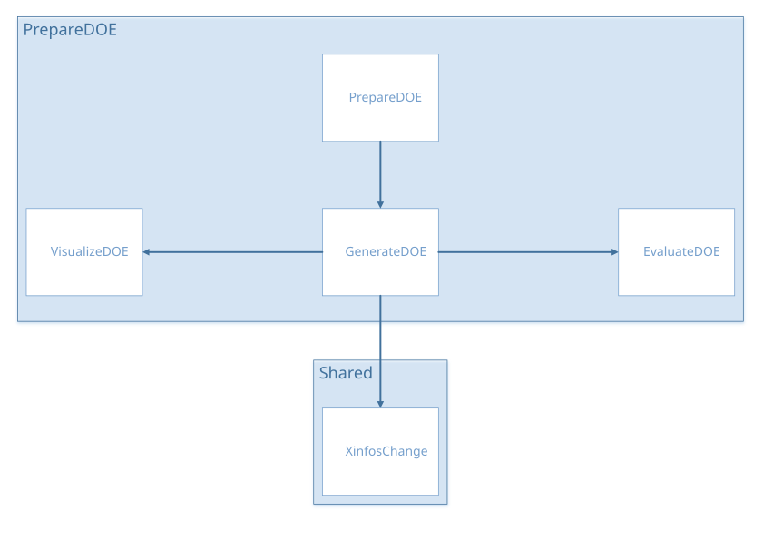

Prepare DOE
###########

Tutorial
********

.. |pdf| image:: ../_images/icons/pdf64.png
   :target: https://gitlab.com/drti/lagun/-/raw/master/documentation/tutorials/Lagun_Tutorial1_Design%20of%20experiments.pdf

.. list-table::
   :widths: 80 20

   * - Design of experiments
     - |pdf|

Architecture
************

prepareDOE.R
************

UI and Server functions
=======================

``source("modules/prepareDOE/generateDOE.R", local = TRUE)``

.. py:function:: prepareDOE.ui(id)

   This function creates the panel *Generate DOE* and populates it by calling the ``generateDOE.ui()`` function

   :param character id: namespace of the module

.. py:function:: prepareDOE.server(input, output, session, settings)

   This function builds a list-like object named output that contains all of the code needed to update the R objects in the app.

   :param list-like-object input: stores the widgets' values.
   :param list-like-object output: stores the instructions to build R objects in the app.
   :param object session: environment that can be used to access information and functionality relating to the session.
   :param list-like-object settings: variables specified in settingsDOE.R

   .. rubric:: Main reactives: 
   
   calls ``generateDOE.server()``

generateDOE.R
*************

``source("modules/shared/XinfosChange.R", local = TRUE)``
``source("modules/prepareDOE/evaluateDOE.R", local = TRUE)``
``source("modules/prepareDOE/visualizeDOE.R", local = TRUE)``
	
UI and Server functions
=======================

.. py:function:: generateDOE.ui(id)
   
   This function populates the *Generate DOE* panel

   :param character id: namespace of the module
   
   .. rubric:: Main reactives:
   
   * *Left column*
     
	 * **nX**: number of inputs
	 * **bounds**: input definition/edition using ``XinfosChange.ui()``
	 * **DOE.type**: DOE method selection
	 * **nobs.UI**: sample size selection 
   
   * *Content*
     
	 * Previews the input definition with ``XinfosChange.ui.preview(ns("bounds"))``
   
   * *Bottom*
     
	 * **goDOE**: button to generate DOE
	 * **prepare.gocheckDOE**: button to evaluate DOE
	 * **download**: button to export DOE
	 * **plotVisualize**: calls visualizeDOE module, displays a pairplot to visualize the DOE points repartition. Appears after DOE generation

.. py:function:: generateDOE.server(input, output, session, settings)

   This function builds a list-like object named output that contains all of the code needed to update the R objects in the app.

   :param list-like-object input: stores the widgets' values.
   :param list-like-object output: stores the instructions to build R objects in the app.
   :param object session: environment that can be used to access information and functionality relating to the session.
   :param list-like-object settings: variables specified in settingsDOE.R

   .. rubric:: Main reactives:

   * **DOE** is the reactive expression that stores the point values and the DOE informations (e.g. bounds...)
   * **Xinfos**: stores the bound definition
   * **initialXinfos**: Xinfos generated by default
   * **var.num**, **var.cat**: store the names of the variables (numerical and categorical)
   * **goDOE**: button to generate the DOE, calls ``generateDOEXopt()``
   * **output$scatter**: generates the pairplot to visualize the DOE
   * **plotVisualize**: calls visualizeDOE module, displays the pairplot
   * **output$download**: generates a downloadable CSV file with **DOE$Xopt** variable

Main functions
==============

.. py:function:: sobolsequencecat(u, lvls, weights)
	
   Generates a DOE using a Sobol sequence
   
   :param vector u: vector of observations (sobol sequence)
   :param vector lvls: vector of levels
   :param vector list: list of weights, could be a scalar if the levels share the same weight

   :return: the DOE
   :rtype: vector
  
.. py:function:: generate.DOE.Xopt(nX, nobs, nobs.slide, DOEtype, Xinfos, names.num, names.cat)   
   
   Generates the design of experiment (DOE) using one of the following methods (DOEtype):
   
   .. rubric:: Methods for numerical variables
   
   * LHS Maximin [#Maximin]_
   * LHS Discrepancy [#Discrepancy]_
   * LHS MaxProj (Optimal but slow) [#MaxProj]_
   * Sobol Sequence (Fast but suboptimal exploration) [#SobSeq]_

   .. rubric:: Methods for mixed DOE (categorical and numerical variables)
   
   * LHS for Categorical Inputs (Optimal but large sample size) [#SLHD]_
   * Mixed Sobol Sequence (Fast but suboptimal exploration) [#SobSeq]_
   
   :param integer nX: number of inputs
   :param integer nobs: number of observations
   :param integer nobs.slide: sample size for each category
   :param character DOEtype: method used to generate the DOE points  
   :param data.table Xinfos: variable informations (name, type, lower bound, upper bound, number of levels, levels)
   :param vector names.num: names of numerical variables
   :param vector names.cat: names of categorical variables

   :return: the generated DOE
   :rtype: data.table

Secondary functions
===================

.. py:function:: check.input.size(input, min.value)

   Compares the value of input and min.value, input must not be less than min.value. 
   
   :param integer input: number of inputs
   :param integer min.value: minimum inputs allowed
   
   :return: ``FALSE`` if input is strictly less than min.value, ``TRUE`` otherwise
   :rtype: logical

evaluateDOE.R
*************

UI and Server functions
=======================

.. py:function:: evaluateDOE.ui(id)
   
   This function builds the modal window, it is displayed by clicking on Evaluate DOE

   :param character id: namespace of the module
   
   .. rubric:: Main reactives:
   
   * **check**: button that calls ``compute.checkDOE()``
   * **plot**: displays ``plot.checkDOE()``
   * **plotLHS**: displays ``plot.checkDOE.LHS()``
   
.. py:function:: evaluateDOE.server(input, output, session, DOE, settings)
   
   This function builds a list-like object named output that contains all of the code needed to update the R objects in the app.

   :param list-like-object input: stores the widgets' values.
   :param list-like-object output: stores the instructions to build R objects in the app.
   :param object session: environment that can be used to access information and functionality relating to the session.
   :param object DOE: stores the informations related to the DOE
   :param list-like-object settings: variables specified in settingsDOE.R

   .. rubric:: Main reactives:

   * **checkDOE** is the reactive expression that stores the list of DOEs generated by function ``compute.checkDOE()``
   * **Xinfos**: used to define the bounds 
   * **initialXinfos**: Xinfos generated by default
   * **output$plot**: generates the plot using the ``plot.checkDOE()`` function
   * **output$plotLHS**: generates the plot using the ``plot.checkDOE.LHS()`` function
   
  

Main functions
==============

.. py:function:: get.listDOE(Xopt, lb, ub, ntestMC, callback)

   Creates a list with different DOE types.

   The DOE types are the following:

   * **Faure**, **Halton** and **Sobol** are low discrepency sequences
   * **MC** is a random Monte Carlo sample
   * **DOE** is the user's
   
   :param data.table Xopt: DOE points generated
   :param numeric lb: lower bound
   :param numeric ub: upper bound
   :param numeric ntestMC: number of MC DOE for comparison
   :param function callback: function used to report progress
   
   :return: list of DOEs
   :rtype: list
  

Plot functions
==============

.. py:function:: plot.checkDOE(listDOE)
   
   Three boxplots are displayed in order to compare the DOE types according to three criterions:
   
   * Maximin [#Maximin]_
   * Discrepancy [#Discrepancy]_
   * MaxProj [#MaxProj]_
   
   The DOE types are the following:

   * **Faure**, **Halton** and **Sobol** are low discrepency sequences
   * **MC** is a random Monte Carlo sample
   * **DOE** is the user's
   
   :param list listDOE: list of DOEs, generated by get.listDOE()

.. thumbnail:: ../_images/graphs/prepareDOE_plotcheckDOE.png
   :align: center
   :title: plot.checkDOE()
   :class: framed

.. py:function:: plot.checkDOE.LHS(listDOE)
   
   Diplays a boxplot to compare the chi2 distance between the different DOE types and the LHS for each variable.
   It shows how far the points are from a LHS position, and gives an insight about the quality of the repartition.
      
   :param list listDOE: list of DOEs

.. thumbnail:: ../_images/graphs/prepareDOE_plotcheckDOE_LHS.png
   :align: center
   :title: plot.checkDOE.LHS()
   :class: framed

Secondary functions
===================

.. py:function:: compute.checkDOE(Xopt, Xinfos, ntestMC, all.numeric)
   
   Checks if the all the values are numeric since no evaluation method is available for a DOE with categorical variables.
   If it is true, calls the function get.listDOE() to create a list of DOEs in order to compare them.
   
   :param data.table Xopt: DOE points generated
   :param data.table Xinfos: variable information (name, type, lower bound, upper bound, number of levels, levels)
   :param numeric ntestMC: number of MC DOE for comparison
   :param logical all.numeric: ``TRUE`` if all the variables are numeric, ``FALSE`` otherwise
   
   :return: list of DOEs
   :rtype: list
   
visualizeDOE.R
**************

UI and Server functions
=======================

.. py:function:: visualizeDOEUI(id)

   Displays the pairplot and two pickerInputs for the numeric variables, and the levels of categorical variables.
   
   :param character id: namespace of the module

   .. rubric:: Main reactives:
   
   * **numericSelection**: numeric variable selection
   * **categoricalSelection**: categorical variable selection
   * **numSelectionClosed**: informs whether the numericSelection picker is loaded or hidden
   * **catSelectionClosed**: informs whether the categoricalSelection picker is loaded or hidden
   * **pairPlot**: displays the pairplot
   

.. py:function:: visualizeDOEServer(id, data, numericVariables, categoricalVariables, mapNames)

   :param character id: namespace of the module
   :param data.table data: table containing the data
   :param vector numericVariables: contains the numeric variable names
   :param vector categoricalVariables: contains the categorical variable names
   :param data.frame mapNames: a data.frame with 3 columns (names, menu, visu), containing the different names of the variables. They can be different in the data table, the menus, or the plots

   .. rubric:: Main reactives:
   
   * **numericSelection**: numeric variable selection
   * **categoricalSelection**: categorical variable selection
   * **output$pairPlot**: builds the pairplot

Plot functions
==============

.. py:function:: pairPlot(data, numericSelection, categoricalSelection, mapNames)

   Creates a pairplot to visualize the DOE point repartition. 
   The points are colorized by group of levels if categoricalSelection is not NULL.

   :param data.table data: table containing the data
   :param vector categoricalSelection: contains the numeric variable names selected by the user
   :param vector categoricalSelection: contains the categorical variable names selected by the user
   :param data.frame mapNames: a data.frame with 3 columns (names, menu, visu), containing the different names of the variables. They can be different in the data table, the menus, or the plots

Secondary functions
===================

.. py:function:: getJsPickerEvent(pickerID, shinyInputID)

   Returns two javascript functions to trigger an event when the menu is loaded, and when it's hidden.

   :param character pickerID: the picker on which to apply the functions
   :param character shinyInputID: the desired name for the event, will be used as an input in the shiny app

.. py:function:: buildCategoricalSelection(data, categoricalVariables, mapNames, separator = "|")

   Creates a list of named lists. The sublists are named after the categorical variables, they contain their levels.
   As the pickerInput returns a vector with the selection, and in order to identify which level belong to which variable, the variables names and levels
   are concatenated using the separator ("|" by default).

   :param data.table data: table containing the data
   :param vector categoricalVariables: contains the categorical variable names
   :param data.frame mapNames: a data.frame with 3 columns (names, menu, visu), containing the different names of the variables. They can be different in the data table, the menus, or the plots
   :param character separator: character used to separate the variable name from the level (default = "|")

.. py:function:: buildCatLevelsList(categoricalSelection, separator = "|")

   Splits the elements of the selection by the separator ("|" by default) and builds a list of named lists. Each list contains the selected levels for each variable.

   :param vector categoricalSelection: contains the categorical variable names selected by the user
   :param character separator: character used to separate the variable name from the level (default = "|")
 
References
**********

.. [#Maximin] 

   **Enhanced Stochastic Evolutionnary (ESE) Algorithm For Latin Hypercube Sample (LHS) Optimization Via PhiP Criteria**
   
   R Jin, W. Chen and A. Sudjianto (2005) *An efficient algorithm for constructing optimal design of computer experiments.* Journal of Statistical Planning and Inference, 134:268-287.
   
   
   `R function documentation <https://www.rdocumentation.org/packages/DiceDesign/versions/1.8/topics/maximinESE_LHS>`__
   | R Package: `DiceDesign <https://cran.r-project.org/package=DiceDesign>`__

.. [#Discrepancy] 

   **Enhanced Stochastic Evolutionnary (ESE) Algorithm For Latin Hypercube Sample (LHS) Optimization Via L2-Discrepancy Criteria**
   
   Hickernell F.J. (1998) *A generalized discrepancy and quadrature error bound.* Mathematics of Computation, 67, 299-322.
   
   Pleming J.B. and Manteufel R.D. (2005) *Replicated Latin Hypercube Sampling*, 46th Structures, Structural Dynamics & Materials Conference, 16-21 April 2005, Austin (Texas) – AIAA 2005-1819.
   
   
   `R function documentation <https://www.rdocumentation.org/packages/DiceDesign/versions/1.8/topics/discrepESE_LHS>`__
   | R Package: `DiceDesign <https://cran.r-project.org/package=DiceDesign>`__
   
.. [#MaxProj] 

   **Maximum Projection Latin Hypercube Designs For Continuous Factors**
   
   V Roshan Joseph, Evren Gul, Shan Ba. (2015) *Maximum projection designs for computer experiments*, Biometrika, Volume 102, Issue 2, June 2015, Pages 371–380
   
   
   `R function documentation <https://www.rdocumentation.org/packages/MaxPro/versions/4.1-2/topics/MaxProLHD>`__
   | R Package: `MaxPro <https://cran.r-project.org/package=MaxPro>`__

.. [#SLHD] 

   **Maximin-Distance (Sliced) Latin Hypercube Designs**
   
   Ba, S., Brenneman, W. A. and Myers, W. R. (2015), *Optimal Sliced Latin Hypercube Designs*, Technometrics.
   
   `R function documentation <https://www.rdocumentation.org/packages/SLHD/versions/2.1-1/topics/maximinSLHD>`__
   | R Package: `SLHD <https://cran.r-project.org/package=SLHD>`__

.. [#SobSeq] 

   **Scrambled Sobol's Low Discrepancy Sequences**
   
   Bratley P., Fox B.L. (1988); *Algorithm 659: Implementing Sobol's Quasirandom Sequence Generator*, ACM Transactions on Mathematical Software 14, 88--100.

   Joe S., Kuo F.Y. (1998); *Remark on Algorithm 659: Implementing Sobol's Quasirandom Sequence Generator.*
   
   `R function documentation <https://www.rdocumentation.org/packages/fOptions/versions/3042.86/topics/LowDiscrepancy>`__
   | R Package: `fOptions <https://cran.r-project.org/package=fOptions>`__
