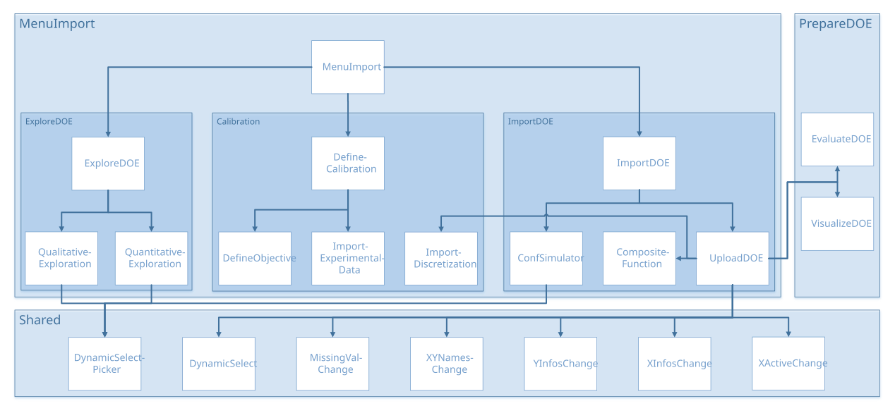

Menu Import
###########

Tutorials
*********

.. |pdf_1| image:: ../_images/icons/pdf64.png
   :target: https://gitlab.com/drti/lagun/-/raw/master/documentation/tutorials/Lagun_Tutorial2.1_DOE%20Import%20and%20Simulator%20Configuration.pdf

.. |pdf_2| image:: ../_images/icons/pdf64.png
   :target: https://gitlab.com/drti/lagun/-/raw/master/documentation/tutorials/Lagun_Tutorial2.2_Exploration.pdf

.. list-table::
   :widths: 80 20

   * - DOE Import and Simulator Configuration
     - |pdf_1|
   * - Exploration
     - |pdf_2|

Architecture
************

menuImport.R
************

UI and Server functions
=======================

``source("modules/menuImport/importDOE/importDOE.R", local = TRUE)``
``source("modules/menuImport/calibration/defineCalibration.R", local = TRUE)``
``source("modules/menuImport/exploreDOE/exploreDOE.R", local = TRUE)``

.. py:function:: menuImport.ui(id)

   This function adds the menu "Import Data" to the user interface.

   :param character id: namespace of the module
   
   .. rubric:: Main reactives:

   * **Import DOE**: tabPanel in the menu, calls ``importDOE.ui()`` with id **tabimportDOE**
   * **Define Calibration**: tabPanel in the menu, calls ``defineCalibration.ui()`` with id **tabdefineCalib**
   * **Preliminary Exploration**: tabPanel in the menu, calls ``exploreDOE.ui()`` with id **tabprelimExplo**

.. py:function:: menuImport.server(input, output, session, DOEX, Xadd, XaddUQ, XaddSeqOptim, XaddUnconstOptim, XaddConstOptim, settings, import.clicked, prelimexplo.clicked, window.dimension)

   This function builds a list-like object named output that contains all of the code needed to update the R objects in the app.

   :param list-like-object input: stores the widgets' values.
   :param list-like-object output: stores the instructions to build R objects in the app.
   :param object session: environment that can be used to access information and functionality related to the session.
   :param list DOEX: stores the input point values and the input DOE information (e.g. bounds...)
   :param object Xadd: extra points in the DOE to refine the model
   :param object XaddUQ: extra points in the DOE to refine the model in specific zones (low and/or high values)
   :param object XaddSeqOptim: extra points in the DOE to refine the model for a sequential optimization
   :param object XaddUnconstOptim: extra points in the DOE to confirm unconstrained optimization results
   :param object XaddConstOptim: extra points in the DOE to confirm constrained optimization results
   :param list-like-object settings: variables specified in settingsDOE.R
   :param logical import.clicked: informs if the user selected the import DOE tab
   :param logical prelimexplo.clicked: informs whether the user selected the preliminary exploration tab
   :param object window.dimension: dimensions of the window
   
   .. rubric:: Main reactives:

   * **OutputimportDOE**: calls the module ``importDOE.server()`` with id **importDOE**
   * **calibDOE**: calls the module ``defineCalibration.server()`` with id **defineCalibration**
   * **ML**: calls the module ``exploreDOE.server()`` with id **exploreDOE**
   * **filteredDOE**: reactive expression containing the DOE definition with the inputs filtered by the user.  

Import DOE
**********

importDOE.R
===========

``source("modules/menuImport/importDOE/uploadDOE.R", local = TRUE)``
``source("modules/menuImport/importDOE/confSimulator.R", local = TRUE)``

UI and Server functions
-----------------------

.. py:function:: importDOE.ui(id)

   Displays the panel asking to use a simulator, and the panel to upload a file 

   :param character id: namespace of the module

.. py:function:: importDOE.server(input, output, session, DOEX, Xadd, XaddUQ, XaddSeqOptim, XaddUnconstOptim, XaddConstOptim, settings, import.clicked)

   :param list-like-object input: stores the widgets' values.
   :param list-like-object output: stores the instructions to build R objects in the app.
   :param object session: environment that can be used to access information and functionality related to the session.
   :param list DOEX: stores the input point values and the DOE input information (e.g. bounds...)
   :param object Xadd: extra points in the DOE to refine the model
   :param object XaddUQ: extra points in the DOE to refine the model in specific zones (low and/or high values)
   :param object XaddSeqOptim: extra points in the DOE to refine the model for a sequential optimization
   :param object XaddUnconstOptim: extra points in the DOE to confirm unconstrained optimization results
   :param object XaddConstOptim: extra points in the DOE to confirm constrained optimization results
   :param list-like-object settings: variables specified in settingsDOE.R
   :param logical import.clicked: ``TRUE`` when the tab *import DOE* is clicked
   
   .. rubric:: Main reactives:

   * **upload_file_bool**: checks if the user uploaded a file
   * **use_simulator**: checks if the user wants to connect a simulator

   Three data import use cases are available, hence the need of **upload_file_bool**:
   
   * Upload a file
   * Use a simulator and the DOE generated in the prepareDOE tab
   * Use a simulator and upload a file

  
.. py:function::   dataModal()

   creates graphical elements 

uploadDOE.R
===========
``source("modules/shared/XinfosChange.R", local = TRUE)``
``source("modules/shared/XactiveChange.R", local = TRUE)``
``source("modules/shared/YinfosChange.R", local = TRUE)``
``source("modules/shared/XYnamesChange.R", local = TRUE)``
``source("modules/shared/missingValChange.R", local = TRUE)``
``source("modules/shared/dynamicSelect.R", local = TRUE)``
``source("modules/prepareDOE/evaluateDOE.R", local = TRUE)``
``source("modules/prepareDOE/visualizeDOE.R", local = TRUE)``
``source("modules/menuImport/importDOE/compositeFunction.R", local = TRUE)``
``source("modules/menuImport/importDOE/importDiscretization.R", local = TRUE)``

UI and Server functions
-----------------------

.. py:function:: uploadDOE.ui(id)

   displays graphical components for the upload process

   :param character id: namespace of the module

.. py:function:: uploadDOE.server(input, output, session, settings)

   :param list-like-object input: stores the widgets' values.
   :param list-like-object output: stores the instructions to build R objects in the app.
   :param object session: environment that can be used to access information and functionality related to the session.
   :param list-like-object settings: variables specified in settingsDOE.R
   
   .. rubric:: Main reactives:

   * **output$import.dynui**: displays UI by taking into account **displayui$mode**
   * **displayui$mode**: the mode changes along the process to display the right UI
   * **output$tabimport.dynui**: displays UI by calling three ids: **upload.dynui**, **sepdec.dynui**, **preview.dynui**
   * **output$upload.dynui**: displays import elements
   * **output$sepdec.dynui**: displays elements to change the separator and the decimal character
   * **file.data**: reads and stores file content
   * **output$preview.dynui**: displays a preview of the file to check the loading
   * **output$preview**: displays output variables information
   * **output$taboutputs.dynui**: displays elements to change output types and shows some output information
   * **DOEfinal**: contains the DOE definition and data
   * **output$tabfinish.dynui**: displays a summary before import confirmation

Main functions
--------------

.. py:function:: my.summary(x, ...)

   Computes descriptive statistics: mean, standard-deviation, min, max, quantile variation

   :param vector x: vector of numeric data
   :param - ....: ellipsis
   
   :return: computed statistics
   :rtype: vector

.. py:function:: compute.summary(Y, my.summary, Yinfos)

   Computes summary for all variables 

   :param data.frame Y: data
   :param function my.summary: computes descriptive statistics
   :param list Yinfos: variable information

   :return: computed statistics
   :rtype: matrix

.. py:function:: checkValid.XYData(XY, nX)
   
   Checks the validity of XYData using three conditions:
   
   * XY must be not null
   * XY must be a data.frame
   * nX must be greater than the number of columns in XY
   
   :param data.frame XY: data
   :param numeric nX: number of variables
   
   :return: ``TRUE`` if valid, ``FALSE`` otherwise
   :rtype: logical

.. py:function:: get.XYdata(XY, nX, header, firstcol, namesvisu, namesmenu)

   Forms the data in the right shape for Lagun

   :param data.frame XY: experience parameters and outputs
   :param numeric nX: number of variables
   :param logical header: presence of header
   :param logical firstcol: if the first column indicates the observation number
   :param vector namesvisu: vector of variable names processed for plots
   :param vector namesmenu: vector of variable names processed for menus
   
   :return: XYData
   :rtype: list

Secondary functions
-------------------

.. py:function:: get.Xinfos.col(ind, XDOE, xnames, xnamesvisu, xnamesmenu, nvalues)

   Evaluates whether the variable's type is numeric, a constant, or categorical

   :param numeric ind: index of column to evaluate
   :param data.frame XDOE: stores the input point values and the input DOE information (e.g. bounds...)
   :param vector xnames: vector of variable names
   :param vector namesvisu: vector of variable names processed for plots
   :param vector namesmenu: vector of variable names processed for menus
   :param numeric nvalues: number of values for the variable

   :return: Xinfos.col
   :rtype: list

.. py:function:: get.Yinfos.col(ind, YDOE, nvalues, threshold.var)

   Focuses on the target variables. Evaluates its type: status (if not numeric), constant or interest

   :param numeric ind: index of column to evaluate
   :param object YDOE: stores the output point values and the DOE output information (e.g. bounds...)
   :param numeric nvalues: number of values for the variable
   :param numeric threshold.var: threshold variation, if the quantile variation is below this threshold, the variable is considered a constant
   
   :return: Yinfos.col
   :rtype: list

compositeFunction.R
===================

UI and Server functions
-----------------------

.. py:function:: compositeFunctionUI(id)

   :param character id: namespace of the module
   
   .. rubric:: Main reactives:
   
   * **createCompFunc**: button to call the modal **modalAddCompFunc** that allows to create a composite output
   * **existingCompFunc**: displays the existing composite outputs, alongside with a delete button
   

.. py:function:: compositeFunctionServer(id, DOE)

   :param character id: namespace of the module
   :param object DOE: stores the point values and the DOE information (e.g. bounds...)
   
   .. rubric:: Main reactives:

   * **output$existingCompFunc**: displays the existing composite outputs, alongside with a delete button
   * **output$modalAddCompFunc**: modal that allows to create a composite output
   * **output$latexFormula**: displays the formula in latex format
   * **input$addCompFunc**: performs a few checks, creates the composite output and updates compositeInfos object
   

Main functions
--------------

.. py:function:: latexify(formula, name)
	
   This functions translates the formula in R language into a latex formula
	
   :param character formula: formula entered by the user
   :param character name: name of the composite output

.. py:function:: getUsedParams(formula, ynames)
	
   Identifies the output(s) used in the formula
	
   :param character formula: formula entered by the user
   :param list ynames: list of the output names in the DOE

.. py:function:: checkName(name, xnames, ynames)
   
   Performs the following verifications on the name:
   
   * It must not be empty
   * It must be unique
   * it must only contain letters, numbers, "_", and "."
   
   :param character name: name of the composite output (entered by the user)
   :param list xnames: list of the input names in the DOE
   :param list ynames: list of the output names in the DOE

.. py:function:: checkFormula(formula, usedParams, modelMode, type, Y)
   
   Performs the following verifications on the formula:
   
   * It must not be empty
   * It must contain at least one output
   * It must be a valid expression
   * It must not trigger an error nor a warning when evaluated
   * It must only contain numbers if numeric type is selected
   * It must not contain log or ln if combine mode is selected
   
   :param character formula: formula entered by the user
   :param list usedParams: parameters used in formula
   :param character modelMode: informs whether a model should be trained or combine the models from the used parameters
   :param character type: selected output type (numeric or categorical)
   :param data.frame Y: output values of the imported DOE

Secondary functions
-------------------

.. py:function:: findAllFunctions(formula, funcName, nbToFind, res)
   
   Finds recusively all functions to replace in latexify function
   
   :param character formula: formula entered by the user
   :param character funcName: add_description
   :param numeric nbToFind: number of funcName to find in the formula (default=NULL)
   :param list res: each element contains two fields, fullFunc (function name and its content) and content (expression between parentheses) 

.. py:function:: indicator(expr)
   
   Wrapper for ifelse function, returns ifelse(expr, 1, 0)
   
   :param expression expr: logical expression

.. py:function:: pln(y)
   
   .. math::
	  
	  pln(y) &= \ln(1+ y'), \quad\mbox{if}\quad y' ≥ 0

	  pln(y) &= -\ln(1- y'), \quad\mbox{if}\quad y' < 0
   
   :param vector y: data

.. py:function:: plog(y)
   
   .. math::
	  
	  plog(y) &= \log(1+ y'), \quad\mbox{if}\quad y' ≥ 0

	  plog(y) &= -\log(1- y'), \quad\mbox{if}\quad y' < 0 
   
   :param vector y: data

..
   confSimulator.R
   ===============

   UI and Server functions
   -----------------------

   Main functions
   --------------

   Plot functions
   --------------

   Secondary functions
   -------------------

   .. py:function:: confSimulator.ui(id)

      :param character id: namespace of the module

   .. py:function:: confSimulator.server(input, output, session, DOEX, DOE.manual, Xadd, XaddUQ, XaddSeqOptim, XaddUnconstOptim, XaddConstOptim, upload_file_bool, use_simulator, settings)

      :param list-like-object input: stores the widgets' values.
      :param list-like-object output: stores the instructions to build R objects in the app.
      :param object session: environment that can be used to access information and functionality related to the session.
      :param list DOEX: stores the input point values and the DOE input information (e.g. bounds...)
      :param list DOE.manual: *generated DOE ?*
      :param object Xadd: extra points in the DOE to refine the model
      :param object XaddUQ: extra points in the DOE to refine the model in specific zones (low and/or high values)
      :param object XaddSeqOptim: extra points in the DOE to refine the model for a sequential optimization
      :param object XaddUnconstOptim: extra points in the DOE to confirm unconstrained optimization results
      :param object XaddConstOptim: extra points in the DOE to confirm constrained optimization results
      :param logical upload_file_bool: logical to know if the user umploaded a DOE file
      :param logical use_simulator: informs if the user uses a simulator linked to Lagun
      :param list-like-object settings: variables specified in settingsDOE.R
      
      :return: DOE & advance.simu
      :rtype: list
      
      .. rubric:: Details *(to be completed)*:

      * **detail** descprition

Explore DOE
***********

exploreDOE.R
============
``source("modules/menuImport/exploreDOE/qualitativeExploration.R", local = TRUE)``
``source("modules/menuImport/exploreDOE/quantitativeExploration.R", local = TRUE)``

UI and Server functions
-----------------------

.. py:function:: exploreDOE.ui(id)

   This function creates the exploration page with two panels : qualitative exploration and quantitative exploration with Machine Learning tools

   :param character id: namespace of the module

   .. rubric:: Main reactives:

   * **modalViewDOE**: calls a modal view to display table of the current DOE
   * **qualitativeExploration**: populates the *Qualitative Exploration* panel
   * **quantitativeExploration**: populates the *Quantitative Exploration* panel

.. py:function:: exploreDOE.server(input, output, session, DOE, settings, prelimexplo.clicked, advance.importDOE, use_simulator, window.dimension)

   This function builds a list-like object named output that contains all of the code needed to update the R objects in the app.

   :param list-like-object input: stores the widgets' values.
   :param list-like-object output: stores the instructions to build R objects in the app.
   :param object session: environment that can be used to access information and functionality related to the session.
   :param object DOE: stores the point values and the DOE information (e.g. bounds...)
   :param list-like-object settings: variables specified in settingsDOE.R
   :param logical prelimexplo.clicked: informs whether the user selected the preliminary exploration tab
   :param object advance.importDOE: stores the simulation information status (completed/waiting/running) when Lagun is connected to an external simulator
   :param logical use_simulator: informs if the user uses a simulator linked to Lagun
   :param object window.dimension: dimensions of the window
   
   .. rubric:: Main reactives:

   * **currentDOE**: reactive expression containing the DOE definition
   * **output$DTcurrentDOE**: displays the DOE as a table 
   * ``qualitativeExploration.server()`` module called
   * **ML**: calls module ``quantitativeExploration.server()``  
   

qualitativeExploration.R
========================
``source("modules/shared/dynamicSelect.R", local = TRUE)``
``source("modules/shared/dynamicSelectpicker.R", local = TRUE)``

UI and Server functions
-----------------------

.. py:function:: qualitativeExploration.ui(id)
   
   Displays the panel with three tabs, each containing an interactive plot.
   
   :param character id: namespace of the module

   .. rubric:: Main reactives:

   * *Regression plot - One by One*

     * **chooseY**: Y axis variable selector
     * **chooseX**: X axis variable selector
     * **chooseRegColor**: color marks by selected variable value
     * **chooseRegSize**: change size marks by selected variable value
     * **chooseRegMark**: change type of mark by selected variable value
     * **showhist**: switch button to display histograms on the axes 
     * **plot.reg**: displays regression plot

   * *Parallel coordinate plot*

     * **choose.palette.num**: color palette selector for numerical variables
     * **choose.palette.cat**: color palette selector for categorical variables
     * **downloadpcp**: export plot
     * **chooseXParcoords**: input variables selector
     * **chooseYParcoords**: output variables selector
     * **chooseHistParcoords**: variable selection to display histogram
     * **chooseBoundsParcoords**: bound selection for a variable
     * **parcoords**: displays parallel plot

   * *Regression plot - All in One*

     * **plot.allinone**: displays regression plots for all variables, pairwise.

.. py:function:: qualitativeExploration.server(input, output, session, DOE, window.dimension)

   :param list-like-object input: stores the widgets' values.
   :param list-like-object output: stores the instructions to build R objects in the app.
   :param object session: environment that can be used to access information and functionality related to the session.
   :param object DOE: stores the point values and the DOE information (e.g. bounds...)
   :param object window.dimension: dimensions of the window
   
   :return: DOE
   :rtype: object
   
   .. rubric:: Main reactives:

   * *Regression plot - One by One*

     * **choicesX**: contains all the variables for the X axis. Inputs come first.
     * **Xcat**: contains the input categorical variables
     * **Ycat**: contains the output categorical variables
     * **Allcat**: contains all the categorical variables
     * **Allb**: contains all the bounds
     * **choicesY**: contains all the variables for the Y axis. Outputs come first.
     * **choicesRegColor**: contains all the variables to apply different colors
     * **choicesRegSize**: contains all the continuous variables to apply different sizes
     * **choicesRegMark**: contains all the categorical variables to apply different mark types
     * **output$regression**: calls ``plot.regression()``
     * **output$plot.reg**: displays the regression plot

   * *Regression plot - All in One*

     * **choicesXallinone**: contains all the input variables
     * **currentview**: computes the number of rows and columns in the lattice
     * **input$goPrevious / goNext / goUp / goDown**: navigation in the lattice
     * **output$plot.allinone**: descprition
     * **output$ui.treillis**: displays lattice navigation buttons
     * **output$plotallinone.treillis**: builds the plot
     * **output$plot.allinone.inside**: displays the plot

   * *Parallel coordinate plot*

     * **choicesXParcoords**: list of input variables
     * **selectedXParcoords**: selected input variables
     * **choicesYParcoords**: list of output variables
     * **selectedYParcoords**: selected output variables
     * **choicesHistParcoords**: list of all variables for histogram selection
     * **choicesBoundsParcoords**: list of all variables for bounds edition
     * **output$dynui_bounds**: renders UI
     * **output$parcoords**: displays the parallel plot
     * **choicescluster**: contains the variables to use for clustering
     * **cluster**: contains clusters computed with *kMeans*
     * **output$downloadpcp**: creates a downloadable html parallel plot 

Plot functions
--------------

.. py:function:: plot.regression(df, xname, yname, colorname, sizename, markname, catnames, showhist, xnamevisu, ynamevisu, colnamevisu, adapt.visu)

   Displays a plot to observe interactions between variables.

   :param data.frame df: data to plot
   :param character xname: x name in df
   :param character yname: y name in df
   :param character colorname: colors to apply
   :param numeric sizename: size to apply
   :param character markname: mark to use
   :param list catnames: categories names
   :param logical showhist: informs if a histogram should be displayed on x and y axis
   :param character xnamevisu: x axis title
   :param character ynamevisu: y axis title
   :param character colnamevisu: color bar title
   :param logical adapt.visu: adapt margins

   :return: plot to display
   :rtype: plotly plot

.. thumbnail:: ../_images/graphs/menuImport_plotreg_box.png
   :align: center
   :title: plot.regression() boxplot
   :class: framed
   :group: plot.regression

.. thumbnail:: ../_images/graphs/menuImport_plotreg_scat.png
   :align: center
   :title: plot.regression() scatterplot
   :class: framed
   :group: plot.regression

.. thumbnail:: ../_images/graphs/menuImport_plotreg_cat_vs_cat.png
   :align: center
   :title: plot.regression() scatterplot categorical
   :class: framed
   :group: plot.regression

quantitativeExploration.R
=========================

``source("modules/shared/dynamicSelect.R", local = TRUE)``

UI and Server functions
-----------------------

.. py:function:: quantitativeExploration.ui(id)
   
   Populates the quantitative exploration panel
   
   :param character id: namespace of the module

   .. rubric:: Main reactives:

   * **ui.cor**: tab that displays correlations plot
   * **ui.hsicdcor**: tab that displays generalized correlations plot
   * **ui.download**: tab that contains buttons to download results

.. py:function:: quantitativeExploration.server(input, output, session, DOE, window.dimension, settings)

   
   :param list-like-object input: stores the widgets' values.
   :param list-like-object output: stores the instructions to build R objects in the app.
   :param object session: environment that can be used to access information and functionality related to the session.
   :param object DOE: stores the point values and the DOE information (e.g. bounds...)
   :param object window.dimension: dimensions of the window
   :param list-like-object settings: variables specified in settingsDOE.R

   .. rubric:: Main reactives:

   * *Correlation tab*

     * **choicesXcor**: list of the input variables
     * **choicesYcor**: list of the output variables
     * **output$ui.cor**: displays correlation plot
     * **output$plot.correl**: builds correlation plot
     * **output$scatterplotCOR**: builds scatter plot

   * *Generalized Correlation tab*
   
     * **xnamehsicdcor**: list of the input variables
     * **ynamehsicdcor**: list of the output variables
     * **output$ui.hsicdcor**: defines UI layout
     * **output$plot.hsicdcor**: displays correlation plot with computed DCOR
     * **output$boxplotDCOR**: displays boxplot with computed DCOR

   * *Download tab*

     * **output$ui.download**: defines UI layout
     * **output$downloadCOR**: download correlations in a CSV file
     * **output$downloadDCOR**: download distance correlations in a CSV file

Main functions
--------------

.. py:function:: computeHSICDCOR(Y, X, nrepML, callback)

   Computes a distance correlation statistics pairwise [#Energy_dcor]_

   :param vector Y: vector data
   :param vector X: vector data
   :param numeric nrepML: number of repetitions 
   :param function callback: reports progress
   
   :return: computed correlations
   :rtype: list

Secondary functions
-------------------

.. py:function:: callback(r)

   Reports progress of a task. Calls R Shiny *incProgress*

   :param numeric r: r\ :sup:`th` iteration

Define Calibration
******************

defineCalibration.R
===================

``source("modules/menuImport/calibration/importExperimentalData.R", local = TRUE)``
``source("modules/menuImport/calibration/defineObjective.R", local = TRUE)``

UI and Server functions
-----------------------

.. py:function:: defineCalibration.ui(id)

   displays graphical components for the calibration process

   :param character id: namespace of the module

.. py:function:: defineCalibration.server(input, output, session, DOE, settings)

   :param list-like-object input: stores the widgets' values.
   :param list-like-object output: stores the instructions to build R objects in the app.
   :param object session: environment that can be used to access information and functionality related to the session.
   :param list DOE: stores the input point values and the input DOE information (e.g. bounds...)
   :param list-like-object settings: variables specified in settingsDOE.R
   
   .. rubric:: Main reactives:

   * **calibDOE**: contains the calibration definition (experimental data, standard deviations, weigths) and objective function values

defineObjective.R
=================

UI and Server functions
-----------------------

.. py:function:: defineObjective.ui(id)

   displays graphical components for the definition of data weights

   :param character id: namespace of the module

.. py:function:: defineObjective.server(input, output, session, DOE, xpData, settings)

   :param list-like-object input: stores the widgets' values.
   :param list-like-object output: stores the instructions to build R objects in the app.
   :param object session: environment that can be used to access information and functionality related to the session.
   :param list DOE: stores the input point values and the input DOE information (e.g. bounds...)
   :param list xpData: contains experimental data and standard deviations
   :param list-like-object settings: variables specified in settingsDOE.R
   
   .. rubric:: Main reactives:

   * **objFunc**: contains the calibration definition (weights, normalization type) and objective function values

importDiscretization.R
======================

UI and Server functions
-----------------------

.. py:function:: importDiscretization.ui(id)

   This function displays a button that calls a modal window in order to import functional outputs discretization

   :param character id: namespace of the module

.. py:function:: importDiscretization.server(input, output, session, DOE)

   :param list-like-object input: stores the widgets' values.
   :param list-like-object output: stores the instructions to build R objects in the app.
   :param object session: environment that can be used to access information and functionality related to the session.
   :param list DOE: stores the input point values and the input DOE information (e.g. bounds...)
   
   .. rubric:: Main reactives:

   * **importDiscF**: contains discretization for functional outputs

importExperimentalData.R
========================

UI and Server functions
-----------------------

.. py:function:: importExperimentalData.ui(id)

   displays graphical components in order to import experimental data and standard deviations

   :param character id: namespace of the module

.. py:function:: importExperimentalData.server(input, output, session, DOE, settings)

   :param list-like-object input: stores the widgets' values.
   :param list-like-object output: stores the instructions to build R objects in the app.
   :param object session: environment that can be used to access information and functionality related to the session.
   :param list DOE: stores the input point values and the input DOE information (e.g. bounds...)
   :param list-like-object settings: variables specified in settingsDOE.R
   
   .. rubric:: Main reactives:

   * **xpData**: contains experimental data and standard deviations

Main functions
--------------

.. py:function:: checkXPdata(data, DOE, ynames)

   Check validity of imported experimental data

   :param data.frame data: contains imported DOE
   :param list DOE: contains the input point values and the input DOE information (e.g. bounds...)
   :param list ynames: list of the output names in the imported DOE
   
   :return: validity information about imported data
   :rtype: list

References
**********

.. [#Energy_dcor] 

   **Distance correlation**
   
   Szekely, G.J., Rizzo, M.L., and Bakirov, N.K. (2007), *Measuring and Testing Dependence by Correlation of Distances*, Annals of Statistics, Vol. 35 No. 6, pp. 2769-2794. 
   
   `R function documentation <https://www.rdocumentation.org/packages/energy/versions/1.7-7/topics/distance%20correlation>`__
   | R Package: `energy <https://cran.r-project.org/package=energy>`__