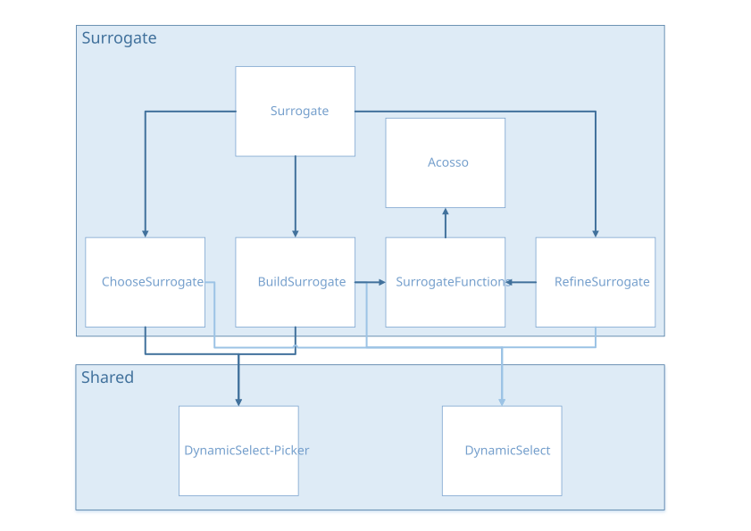

Surrogate
#########

Tutorial
********

.. |pdf| image:: ../_images/icons/pdf64.png
   :target: https://gitlab.com/drti/lagun/-/raw/master/documentation/tutorials/Lagun_Tutorial3_Surrogate%20Models.pdf

.. list-table::
   :widths: 80 20

   * - Surrogate Models
     - |pdf|

Architecture
************

surrogate.R
***********
``source("modules/surrogate/buildsurrogate.R", local = TRUE)``
``source("modules/surrogate/choosesurrogate.R", local = TRUE)``
``source("modules/surrogate/refinesurrogate.R", local = TRUE)``

UI and Server functions
=======================

.. py:function:: surrogate.ui(id)

   This function creates the surrogate model page with three panels:

   * Build Surrogate Models
   * Select Final Surrogate Models
   * Additional Simulations to Refine Surrogate Models

   :param character id: namespace of the module

   .. rubric:: Main reactives:

   * **modalViewDOEsurrogate**: calls a modal view to display table of the current DOE
   * **buildsurrogate**: populates the *Build Surrogate Models* panel
   * **choosesurrogate**: populates the *Select Final Surrogate Models* panel
   * **refinesurrogate**: populates the *Additional Simulations to Refine Surrogate Models* panel

.. py:function:: surrogate.server(input, output, session, DOE, settings, use_simulator, surrogate.clicked, advance.importDOE)

   :param list-like-object input: stores the widgets' values.
   :param list-like-object output: stores the instructions to build R objects in the app.
   :param object session: environment that can be used to access information and functionality relating to the session.
   :param object DOE: stores the point values and the DOE information (e.g. bounds...)
   :param list-like-object settings: variables specified in settingsSurrogate.R
   :param logical use_simulator: informs if the user uses a simulator linked to Lagun
   :param logical surrogate.clicked: informs whether the user selected the surrogate model tab
   :param object advance.importDOE: stores the simulation information status (completed/waiting/running) when Lagun is connected to an external simulator

   .. rubric:: Main reactives:

   * **currentDOE**: reactive expression containing the DOE definition
   * **listmodels**: contains the model information
   * **output$DTcurrentDOEsurrogate**: displays currentDOE inputs and outputs as a table
   * calls modules *buildsurrogate* *choosesurrogate* and *refinesurrogate* 

surrogate_functions.R
*********************
``source('modules/surrogate/acosso.R', local = TRUE)``

Main functions
==============

.. py:function:: build.metamodel(X,Y,Ytype='numeric',type.metamodel="Lasso",categorical=NULL,levels=NULL,acosso2.selvar=NULL,kriging.trend="Constant",kriging.cov=c("Matern32","Matern52","Gauss"),kriging.selvar=NULL,kriging.nugget=FALSE,kriging.estim="MLE",kriging.multi=FALSE,trendobj=NULL,tag.failY="NA")

   This function builds a metamodel among the following:

   * Lasso [#lasso]_
   * ACOSSO 1\ :sup:`st` and 2\ :sup:`nd` order [#acosso]_
   * Kriging [#kriging]_

   :param data.frame X: input data
   :param data.frame Y: output data
   :param character Ytype: output type (numeric or categorical)
   :param character type.metamodel: type of metamodel to (default="Lasso")
   :param list categorical: index list of the categorical variables if any (default=NULL)
   :param list levels: levels of the categorical variable indices if any (default=NULL)
   :param list acosso2.selvar: index list of selected variables to build the metamodel of type ACOSSO 2 (default=NULL)
   :param character kriging.trend: specifies the trend of the kriging model (default="Constant")
   :param character kriging.cov: covariance structure to be used (by default Matern32, Matern52, and Gauss are tested and the best is selected)
   :param list kriging.selvar: index list of selected variables to build the Kriging metamodel (default=NULL)
   :param logical kriging.nugget: indicates whether the nugget effect should be estimated (default=FALSE)
   :param string kriging.estim: method by which unknown parameters are estimated (default="MLE", Maximum Likelihood)
   :param logical kriging.multi: indicates whether the multiple optimizations should be performed (default=FALSE)
   :param object trendobj: contains the metamodel specified by kriging.trend (default=NULL)
   :param character tag.failY: character by which missing values are specified (default="NA")

.. py:function:: predict.metamodel(obj, Xnew, computesd=TRUE, sdreweightedloo=FALSE)

   Predicts the outputs for new observations with a trained metamodel

   :param object obj: contains the built metamodel
   :param data.frame Xnew: contains the input points to perform prediction
   :param logical computesd: indicates the whether the standard deviation should be computed (default=TRUE)
   :param logical sdreweightedloo: indicates whether the standard deviation should be weighted by the error (default=FALSE)

.. py:function:: update.metamodel(obj, Xadd, Yadd)

   Updates an existing metamodel with extra data points

   :param object obj: contains the built metamodel
   :param data.frame Xadd: contains the extra input points to refine the existing model
   :param data.frame Yadd: contains the extra output points to refine the existing model

.. py:function:: onestep.improve.metamodel(objs, Xtotest, criterion="mse", Xint=NULL, target=0, idconstr=NULL, signconstr=NULL, thconstr=NULL)

   Selects the best points in Xtotest using the choosen criterion in order to refine the model.

   The criterions are choosen among the following:

      * **mse**: Mean Squared Error
      * **imse**: Integrated Mean Squared Error
      * **ego.min**, **ego.max**: Efficient Global Optimization
      * **efi.min**, **efi.max**: Expected Feasible Improvement
      * **ranjan**
      * **local_categorical**

   :param object objs: contains the metamodels
   :param data.frame Xtotest: contains input points to test
   :param character criterion: specifies the metric that should be used to identify next point to compute (default="mse")
   :param data.frame Xint: contains the input points to perform prediction (default=NULL)
   :param numeric target: target variable (default=0)
   :param numeric idconstr: output id on which to apply constraint (default=NULL)
   :param numeric signconstr: -1 or 1, defines the sign of the constraint(default=NULL)
   :param numeric thconstr: threshold constraint (default=NULL)

.. py:function:: fit.krigeage.classif(Xmodel, Y)

   Fits a classification kriging model

   :param data.frame Xmodel: input training data
   :param data.frame Y: output training classes

acosso.R
********

The source file *acosso.R* [#acosso]_ (provided online) documents every function. Please refer to it for further information.

buildsurrogate.R
****************
``source("modules/shared/dynamicSelect.R", local = TRUE)``
``source("modules/shared/dynamicSelectpicker.R", local = TRUE)``
``source('modules/surrogate/surrogate_functions.R', local = TRUE)``

UI and Server functions
=======================

.. py:function:: buildsurrogate.ui(id)

   This function populates the *Build Surrogate Models* panel

   :param character id: namespace of the module

   .. rubric:: Main reactives:

   * **surrogatemode**: mode selection (normal or expert)
   * **buildacosso1**: button to train acosso1 model
   * **buildacosso2**: button to train acosso2 model
   * **buildkriging**: button to train kriging model
   * **buildlasso**: button to train lasso model
   * **retrain**: switch to allow re-training of the models
   * **tableQ2**: table containing models with the computed Q2

.. py:function:: buildsurrogate.server(input, output, session, DOE, listmodels, settings, surrogate.clicked)

   :param list-like-object input: stores the widgets' values.
   :param list-like-object output: stores the instructions to build R objects in the app.
   :param object session: environment that can be used to access information and functionality related to the session.
   :param object DOE: stores the point values and the DOE information (e.g. bounds...)
   :param list listmodels: list of trained models
   :param list-like-object settings: variables specified in settingsSurrogate.R
   :param logical surrogate.clicked: informs whether the user selected the surrogate model tab

   .. rubric:: Main reactives:

   * **whatwastrained**: stores which metamodels for which outputs have been trained
   * **askedtrained**: stores the user's asks
   * **choicesQ2validation**: selection list for validation criterion
   * **acosso1settings**: button to parameter acosso1 model and launch training
   * **acosso2settings**: button to parameter acosso2 model and launch training
   * **krigingsettings**: button to parameter kriging model and launch training
   * **output$tableQ2**: displays Q2 table
   * **output$ui.Q2visu**: displays Q2 plot
   * **output$plotQ2**: builds Q2 plot

Main functions
==============

.. py:function:: updatebestselected(listmodels, type)

   Selects among the trained models, the one with the highest accuracy (one model for each output)

   :param list listmodels: list of trained models
   :param character type: validation criterion

.. py:function:: computeQ2test(ypredtest, ytest)

   Computes the validation criterion, using Leave-One-Out method.
   A fast algorithm is used for estimation.

   :param vector ypredtest: predicted output values
   :param vector ytest: true output values

.. py:function:: compute.lasso.model(DOE, idY, categorical, levels, callback)

   Builds Lasso metamodel

   :param object DOE: stores the point values and the DOE information (e.g. bounds...)
   :param list idY: indices of outputs to consider
   :param list categorical: indices of categorical variables
   :param list levels: levels of the categorical variables
   :param function callback: reports progress

.. py:function:: compute.acosso.model(DOE, idY, order, categorical, levels, vars=NULL, callback)

   Builds Acosso metamodel

   :param object DOE: stores the point values and the DOE information (e.g. bounds...)
   :param list idY: indices of outputs to consider
   :param numeric order: 1 or 2, selects acosso 1st or 2nd order
   :param list categorical: indices of categorical variables
   :param list levels: levels of the categorical variables
   :param list vars: selected variables to build the metamodel (default=NULL)
   :param function callback: reports progress

.. py:function:: compute.kriging.model(DOE, idY, categorical, levels, vars, trend, trendobj, interpolate, multi, callback)

   Builds Kriging metamodel

   :param object DOE: stores the point values and the DOE information (e.g. bounds...)
   :param list idY: indices of outputs to consider
   :param list categorical: indices of categorical variables
   :param list levels: levels of the categorical variables
   :param list vars: selected variables to build the metamodel
   :param character trend: specifies the trend of the kriging model
   :param object trendobj: contains the metamodel specified by kriging.trend
   :param logical interpolate: use interpolation (model error is null for training set)
   :param logical multi: indicates whether the multiple optimizations should be performed
   :param function callback: reports progress

Secondary functions
===================

.. py:function:: callback(i)__

   Reports progress of a task. Calls R Shiny *incProgress*

   :param numeric i: i\ :sup:`th` iteration

choosesurrogate.R
*****************

UI and Server functions
=======================

.. py:function:: choosesurrogate.ui(id)

   This function populates the *Select Final Surrogate Models* panel

   :param character id: namespace of the module

   .. rubric:: Main reactives:

   * **chooseSelCrit**: validation criterion selection
   * **chooseSurrogate**: panel allowing to select the surrogate model and check its quality

.. py:function:: choosesurrogate.server(input, output, session, DOE, listmodels, settings)

   :param list-like-object input: stores the widgets' values.
   :param list-like-object output: stores the instructions to build R objects in the app.
   :param object session: environment that can be used to access information and functionality related to the session.
   :param object DOE: stores the point values and the DOE information (e.g. bounds...)
   :param list listmodels: list of trained models
   :param list-like-object settings: variables specified in settingsSurrogate.R

   .. rubric:: Main reactives:

   * **choicesSelCrit**: selection list containing validation criterion names
   * **output$chooseSurrogate**: displays the panel to select and check the surrogate model

      * **SelSurrogate**: selection list containing the computed surrogate model names
      * **SavedSurrogate**: selection list containing the saved surrogate models (with the highest Q2)
      * **Q2Surrogate**: button to display the Q2 plot
   
   * **output$plotQ2final**: displays the plot by calling ``plotQ2final()``

Plot functions
==============

.. py:function:: plotQ2final(DOE, surrogatemodel, yname, ynamemenu, namesurrogatemodel, typeQ2)

   Plots the predicted values by the true values to show the quality of the model.
   Prediction computed using the Leave-One-Out method

   :param object DOE: stores the point values and the DOE information (e.g. bounds...)
   :param object surrogatemodel: built metamodel, contains
   :param character yname: predicted variable name
   :param character ynamemenu: predicted variable name processed for menus
   :param character namesurrogatemodel: metamodel name
   :param character typeQ2: validation criterion name

.. thumbnail:: ../_images/graphs/surrogate_plotQ2final.png
   :align: center
   :title: plotQ2final()
   :class: framed   

refinesurrogate.R
*****************
``source("modules/shared/dynamicSelect.R", local = TRUE)``
``source('modules/surrogate/surrogate_functions.R', local = TRUE)``

UI and Server functions
=======================

.. py:function:: refinesurrogate.ui(id)

   This function populates the *Additional Simulations to Refine Surrogate Models* panel

   :param character id: namespace of the module

   .. rubric:: Main reactives:

   * **criteria**: model improvement criteria
   * **chooseY**: output variable selection
   * **nadd**: number of simulations to add
   * **generate**: button to generate the simulations, calls ``computeAdditionalSimulations()``
   * **launch.simu**: button to launch simulations if a simulator is connected to Lagun
   * **preview.dynui**: displays a preview of the generated simulations, allows to download the result

.. py:function:: refinesurrogate.server(input, output, session, DOE, listmodels, use_simulator, settings)

   :param list-like-object input: stores the widgets' values.
   :param list-like-object output: stores the instructions to build R objects in the app.
   :param object session: environment that can be used to access information and functionality related to the session.
   :param object DOE: stores the point values and the DOE information (e.g. bounds...)
   :param list listmodels: list of trained models
   :param logical use_simulator: informs if the user uses a simulator linked to Lagun
   :param list-like-object settings: variables specified in settingsSurrogate.R
   
   .. rubric:: Main reactives:

   * **choicesY**: contains the output variables
   * **simulations**: object that stores the generated input points and the simulation information
   * **models**: contains the selected models
   * **output$preview.dynui**

      * **download**: button to download the generated input points
      * **table**: displays a preview of the generated input points

   * **output$table**: renders the generated input points as a table
   * **output$download**: creates a downloadable CSV file of the table

Main functions
==============

.. py:function:: computeAdditionalSimulations(DOE, nadd, ntest, yname, models, callback)

   Generates additional input points for extra simulations, in order to improve the quality of the model.
   This points can be used if the user is able to compute extra simulations.

   :param object DOE: stores the point values and the DOE information (e.g. bounds...)
   :param numeric nadd: number of points to add
   :param numeric ntest: number of points to test for model improvement
   :param character yname: output variable name
   :param list models: list of the trained models
   :param function callback: reports progress

Secondary functions
===================

.. py:function:: callback(a)__

   Reports progress of a task. Calls R Shiny *incProgress*

   :param numeric a: a\ :sup:`th` iteration

References
**********

.. [#lasso]

   **Cross-validation for glmnet**

   Tibshirani, R.  (1996) *Regression shrinkage and selection via the lasso*. Journal of the Royal Statistical Society, Series B, 58:267–288

   Friedman, J., Hastie, T. and Tibshirani, R. (2008) *Regularization Paths for Generalized Linear Models via Coordinate Descent*, https://web.stanford.edu/~hastie/Papers/glmnet.pdf Journal of Statistical Software, Vol. 33(1), 1-22 Feb 2010 https://www.jstatsoft.org/v33/i01/ 
   
   Simon, N., Friedman, J., Hastie, T., Tibshirani, R. (2011) *Regularization Paths for Cox's Proportional Hazards Model via Coordinate Descent*, Journal of Statistical Software, Vol. 39(5) 1-13 https://www.jstatsoft.org/v39/i05/

   `R function documentation <https://www.rdocumentation.org/packages/glmnet/versions/4.0-2/topics/cv.glmnet>`__
   | R Package: `glmnet <https://cran.r-project.org/package=glmnet>`__

.. [#acosso] 

   **Adaptive COmponent Selection and Shrinkage Operator (ACOSSO)**
   
   Storlie, C. B., Bondell, H. D., Reich, B. J., & Zhang, H. H. (2011), *Surface estimation, variable selection, and the nonparametric oracle property.* Statistica Sinica, 21, 679. 
   
   Source file: `acosso.R <https://www4.stat.ncsu.edu/~hdbondel/software/acosso.R>`__

.. [#kriging]

   **rgasp: Setting up the robust GaSP model**

   Gu, M., Palomo, J., & Berger, J. O. (2019). *RobustGaSP: Robust Gaussian Stochastic Process Emulation in R*. The R Journal, 11(1), 112-136.

   `R function documentation <https://www.rdocumentation.org/packages/RobustGaSP/versions/0.6.1/topics/rgasp>`__
   | R Package: `RobustGaSP <https://cran.r-project.org/package=RobustGaSP>`__