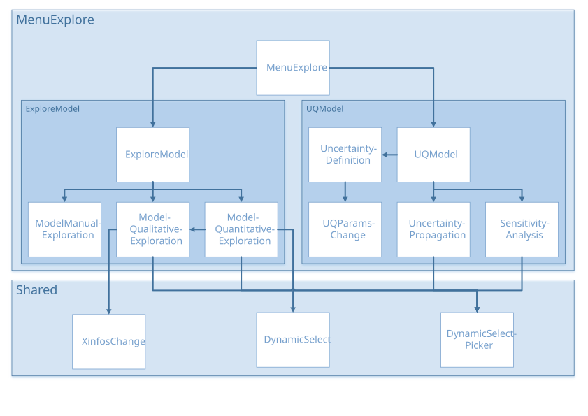

Menu Explore
############

Tutorials
*********

.. list-table::
   :widths: 80 20

   * - Surrogate Exploration
     - |pdf_1|
   * - Uncertainty Propagation
     - |pdf_2|
   * - Sensitivity Analysis
     - |pdf_3|

Architecture
************

menuExplore.R
*************

UI and Server functions
=======================

.. py:function:: menuExplore.ui(id)

   This function adds the menu "Explore" to the user interface.

   :param character id: namespace of the module

   .. rubric:: Main reactives:

   * **Exploration with Surrogate Model**: tabPanel in the menu, calls ``exploreModel.ui()`` with id **exploreModel**
   * **UQ & GSA with Surrogate Model**: tabPanel in the menu, calls ``UQModel.ui()`` with id **UQModel**

.. py:function:: menuExplore.server(input, output, session, DOE, ML, listmodels, use_simulator, window.dimension, settings)

   :param list-like-object input: stores the widgets' values.
   :param list-like-object output: stores the instructions to build R objects in the app.
   :param object session: environment that can be used to access information and functionality relating to the session.
   :param object DOE: stores the point values and the DOE information (e.g. bounds...)
   :param object ML: stores the quantitative exploration of the data
   :param list listmodels: list of trained models
   :param logical use_simulator: informs if the user uses a simulator linked to Lagun
   :param object window.dimension: dimensions of the window
   :param list-like-object settings: variables specified in settingsExploration.R

   .. rubric:: Main reactives:

   * Calls module ``exploreModel.server()`` with id **exploreModel**
   * **simulations**: Calls module ``UQModel.server()`` with id **UQModel**

Explore Model
*************

exploreModel.R
==============

``source("modules/menuExplore/exploreModel/modelQualitativeExploration.R", local = TRUE)``
``source("modules/menuExplore/exploreModel/modelQuantitativeExploration.R", local = TRUE)``
``source("modules/menuExplore/exploreModel/modelManualExploration.R", local = TRUE)``

UI and Server functions
-----------------------

.. py:function:: exploreModel.ui(id)

   This function creates the *Exploration with Surrogate Model* page with three panels:

   * Qualitative Exploration
   * Quantitative Exploration
   * Manual Exploration

   :param character id: namespace of the module

   .. rubric:: Main reactives:

   * Calls ``modelQualitativeExploration.ui()`` with id **modelQualitativeExploration**
   * Calls ``modelQuantitativeExploration.ui()`` with id **modelQuantitativeExploration**
   * Calls ``modelManualExploration.ui()`` with id **modelManualExploration**

.. py:function:: exploreModel.server(input, output, session, DOE, listmodels, window.dimension, settings)

   :param list-like-object input: stores the widgets' values.
   :param list-like-object output: stores the instructions to build R objects in the app.
   :param object session: environment that can be used to access information and functionality relating to the session.
   :param object DOE: stores the point values and the DOE information (e.g. bounds...)
   :param list listmodels: list of trained models
   :param object window.dimension: dimensions of the window
   :param list-like-object settings: variables specified in settingsExploration.R

   .. rubric:: Main reactives:

   * Calls ``modelQualitativeExploration.server()`` with id **modelQualitativeExploration**
   * Calls ``modelQuantitativeExploration.server()`` with id **modelQuantitativeExploration**
   * Calls ``modelManualExploration.server()`` with id **modelManualExploration**

modelQualitativeExploration.R
=============================

UI and Server functions
-----------------------

.. py:function:: modelQualitativeExploration.ui(id)

   This function populates the *Qualitative Exploration* panel, which mainly displays a parallel coordinate plot
   
   :param character id: namespace of the module

   .. rubric:: Main reactives:

   * **keepbounds**: switch to keep bounds
   * **choose.palette.num**: color palette selection for numerical variables
   * **choose.palette.cat**: color palette selection for categorical variables
   * **downloadpcp**: button to export parallel plot
   * **chooseX**: input variable selection
   * **chooseY**: output variable selection
   * **chooseHistParcoords**: variable selection for which a histogram will be displayed
   * **chooseBoundsParcoords**: bound selection for variables
   * **Loadsampling**: button to load a sampling from file
   * **bounds**: button to refine sampling
   * **SMCsettings**: button to perform inverse sampling
   * **parcoords**: displays parallel plot 
   * **dataView**: displays data as a table

.. py:function:: modelQualitativeExploration.server(input, output, session, DOE, listmodels, window.dimension, settings)

   :param list-like-object input: stores the widgets' values.
   :param list-like-object output: stores the instructions to build R objects in the app.
   :param object session: environment that can be used to access information and functionality relating to the session.
   :param object DOE: stores the point values and the DOE information (e.g. bounds...)
   :param list listmodels: list of trained models
   :param object window.dimension: dimensions of the window
   :param list-like-object settings: variables specified in settingsExploration.R

   .. rubric:: Main reactives:

   * **choicesX**: input variable list
   * **selectedX**: selected input variables
   * **choicesY**: output variable list
   * **selectedY**: selected output variables
   * **choicesHistParcoords**: list of variables for which to display a histogram
   * **choicesBoundsParcoords**: list of variables for which to update bounds
   * **parcoordsData**: data generated by ``getParcoordsData()`` or ``getParcoordsDataFromFile()``
   * **selectedParCoords**: data.frame filtered out by user selection
   * **dataPCP**: object that contains the data and every information for the plot
   * **output$parcoords**: renders parallel plot
   * **output$brushed**: builds data table with filtered out by user selection
   * **output$download**: downloadable CSV file containing brushed data
   * **output$downloadpcp**: Downloadable html of parallelPlot
   * **output$dataView**: displays brushed data table

.. thumbnail:: ../_images/graphs/menuExplore_modelQuali_pcp.png
   :align: center
   :title: modelQualitativeExploration PCP
   :class: framed

Main functions
--------------

.. py:function:: getParcoordsData(DOE, nobs, predfunc, Xinfos, Yinfos, callback)

   Generates input data using ``sampleInputs()`` and computes output data for the parallel plot using the selected metamodel

   :param object DOE: stores the point values and the DOE information (e.g. bounds...)
   :param numeric nobs: number of observations expected
   :param function predfunc: computes prediction with the selected metamodels
   :param object Xinfos: input variable information
   :param object Yinfos: output variable information
   :param function callback: reports progress

.. py:function:: getParcoordsDataFromFile(DOE, PCPsample, predfunc, Yinfos, callback)

   Same as ``getParcoordsData()`` but gets the input data from a file

   :param object DOE: stores the point values and the DOE information (e.g. bounds...)
   :param data.frame PCPsample: input sample
   :param function predfunc: computes prediction with the selected metamodel
   :param object Yinfos: output variable information
   :param function callback: reports progress

Secondary functions
-------------------

.. py:function:: sampleInputs(DOE, nobs, Xinfos)

   Generates a sample of data

   :param object DOE: stores the point values and the DOE information (e.g. bounds...)
   :param numeric nobs: number of observations expected
   :param object Xinfos: input variable information

.. py:function:: unrestricted(N, range)

   Generates a random composition with a uniform distribution [#SCMC]_

   :param numeric N: number of datasets to be simulated
   :param matrix range: number of parts

.. py:function:: logpost_vec(sample, nu_t, constraint)

   Computes log-posterior, performs a smoothing of the indicator function [#SCMC]_

   :param vector sample: sample
   :param numeric nu_t: smoothing parameter
   :param function constraint: constraint function

.. py:function:: Gibbs_vec(x, q, d, nu_t, lpdent = lpdent, N, constraint)

   Computes Gibbs sampling, performs a random disturbance on the sample [#SCMC]_

   :param vector x: sample
   :param numeric q: variance of the gaussian that disturbs each dimension
   :param numeric d: dimension index to disturb
   :param numeric nu_t: smoothing parameter
   :param function lpdent: ``logpost_vec()`` function before diturbance, in order to compare after the disturbance. It helps decide whether to accept the disturbance or not.
   :param numeric N: sample size
   :param function constraint: constraint function

.. py:function:: adapt_seq_vec(nu, nu0, t, N, term=term, Wt, constraint)

   Performs adaptive specification of the constraint parameter. It chooses
   the next smoothing parameter by keeping a value of the Effective Samle Size (ESS)
   higher or equal to 1/2. [#SCMC]_

   :param numeric nu: smoothing parameter
   :param numeric nu0: previous smoothing parameter
   :param numeric t: 
   :param numeric N: sample size
   :param numeric term: evaluated sample constraint
   :param numeric Wt: weights of the particles
   :param function constraint: constraint function

.. py:function:: get.constraintfunction(dfparcoords, DOE, Xinfos, predfunc)

   Returns constraint function

   :param data.frame dfparcoords: contains data for the parallel plot
   :param object DOE: stores the point values and the DOE information (e.g. bounds...)
   :param object Xinfos: input variable information
   :param function predfunc: computes prediction with the selected metamodels

.. py:function:: get.lowerupper(dfparcoords, DOE, Xinfos)

   Returns lower and upper bounds

   :param data.frame dfparcoords: contains data for the parallel plot
   :param object DOE: stores the point values and the DOE information (e.g. bounds...)
   :param object Xinfos: input variable information

.. py:function:: SCMC_withcallback(dfparcoords, DOE, Xinfos, predfunc, nsampleSMC, iterSMC, callback)

   Computes inverse sampling [#SCMC]_

   :param data.frame dfparcoords: contains data for the parallel plot
   :param object DOE: stores the point values and the DOE information (e.g. bounds...)
   :param object Xinfos: input variable information
   :param function predfunc: computes prediction with the selected metamodel
   :param numeric nsampleSMC: number of observations
   :param numeric iterSMC: number of iterations
   :param function callback: reports progress

.. py:function:: callback(i)__

   Reports progress of a task. Calls R Shiny *incProgress*

   :param numeric i: i\ :sup:`th` iteration

modelQuantitativeExploration.R
==============================
``source("modules/shared/dynamicSelect.R", local = TRUE)``
``source("modules/shared/dynamicSelect.R", local = TRUE)``
``source("modules/menuExplore/exploreModel/modelQualitativeExploration.R", local = TRUE)``

UI and Server functions
-----------------------

.. py:function:: modelQuantitativeExploration.ui(id)

   This function populates the *Quantitative Exploration* panel with three tabs

   :param character id: namespace of the module

   .. rubric:: Main reactives:

   * *Regression plot - One by One*
      
      *Regression plot using one or two input variables against one output variable.
      The values of the unused input variables is set by the user with the sliders.
      This way, we see the effect of the choosen input(s) on the output with specific values for the other inputs.*

      * **chooseX1**: input variable 1 selection
      * **chooseX2**: input variable 2 selection
      * **chooseY**: output variable selection
      * **chooseVisu**: plot type selection
      * **sliders**: slider to choose the value of the unselected input variables
      * **plotExplo**: displays plot
   
   * *Regression plot with smoothing - All in One*

      *Same as the first regression plot but the mean over all possible values is used for the other inputs instead of a specific value.*

      * **chooseYsmooth**: output variable selection
      * **chooseXsmooth**: input variable selection
      * **ui.treillis**: lattice's number of rows and columns / lattice navigation
      * **ui.smooth**: displays plot

   * *Regression plot with smoothing - All in One (Summary)*

      *Compares all the inputs in the same coordinate system with quantiles.
      It allows to visualize how the output reacts with every input.*

      * **chooseYsmoothsummary**: output variable selection
      * **chooseXsmoothsummary**: input variable selection
      * **ui.smooth.summary**: displays plot

.. py:function:: modelQuantitativeExploration.server(input, output, session, DOE, listmodels, window.dimension, settings)

   :param list-like-object input: stores the widgets' values.
   :param list-like-object output: stores the instructions to build R objects in the app.
   :param object session: environment that can be used to access information and functionality relating to the session.
   :param object DOE: stores the point values and the DOE information (e.g. bounds...)
   :param list listmodels: list of trained models
   :param object window.dimension: dimensions of the window
   :param list-like-object settings: variables specified in settingsExploration.R

   .. rubric:: Main reactives:

   * *Regression plot - One by One*
      
      * **choicesX1**: contains input variables names
      * **choicesX2**: contains input variables names
      * **choicesY**: contains output variables names
      * **choicesVisu**: contains plot types
      * **output$sliders**: displays sliders for value selection
      * **remainingX**: contains the unselected input variable names and values
      * **output$plotExplo**: displays plot
   
   * *Regression plot with smoothing - All in One*

      * **chooseXsmooth**: contains input variables names
      * **chooseYsmooth**: contains output variables names
      * **goPrevious, goNext, goUp, goDown**: buttons for lattice navigation
      * **output$ui.treillis**: displays lattice
      * **output$plot.smooth**: displays plot

   * *Regression plot with smoothing - All in One (Summary)*

      * **xnamesmooth.summary**: input variable selection
      * **ynamesmooth.summary**: output variable selection
      * **output$plot.smooth.summary**: displays plot

Plot functions
--------------

.. py:function:: plotExplo(DOE, predfun, yname, xname1, xname2, remainingX, ncontours, ftemp, visuname)

   Plots either a regression plot, a contour plot, or a 3D suface plot

   :param object DOE: stores the point values and the DOE information (e.g. bounds...)
   :param function predfun: selected metamodel predict function
   :param character yname: output variable name
   :param character xname1: input variable name 1
   :param character xname2: input variable name 2
   :param list remainingX: not selected input variable names and values
   :param numeric ncontours: maximum number of contour levels
   :param numeric ftemp: factor by which to shrink the range (see ``getShrinkedRange()``)
   :param character visuname: type of plot (contour, 3D surface...)

.. thumbnail:: ../_images/graphs/menuExplore_plotExplo.png
   :align: center
   :title: plotExplo() 3D
   :class: framed

Secondary functions
-------------------

.. py:function:: getShrinkedRange(data, rangeFactor)

   Shrinks the range by +/- *range* * *rangeFactor*

   :param vector data: data
   :param numeric rangeFactor: factor by which the range should be shrinked

.. py:function:: callback(i)__

   Reports progress of a task. Calls R Shiny *incProgress*

   :param numeric i: i\ :sup:`th` iteration

modelManualExploration.R
========================

UI and Server functions
-----------------------

.. py:function:: modelManualExploration.ui(id)

   This function populates the *Manual Exploration* panel

   :param character id: namespace of the module

   .. rubric:: Main reactives:

   * **choice**: radio buttons to choose whether to import a file with new data, or enter the data manually in the UI
   * **proceed**: button proceed with the **choice** 
   * **compute**: button to compute predictions
   * **download**: button to export the predictions
   * **content**: table to display the data

.. py:function:: modelManualExploration.server(input, output, session, DOE, listmodels)

   :param list-like-object input: stores the widgets' values.
   :param list-like-object output: stores the instructions to build R objects in the app.
   :param object session: environment that can be used to access information and functionality relating to the session.
   :param object DOE: stores the point values and the DOE information (e.g. bounds...)
   :param list listmodels: list of trained models

   .. rubric:: Main reactives:

   
   * **dataAdd**: contains the new data
   * **input$save**: gets new data from input
   * **input$file$datapath**: gets new data from file
   * **input$compute**: computes prediction for the new data
   * **output$content**: renders new data and predictions as a table
   * **output$download**: builds a CSV file to download data

Main functions
--------------

.. py:function:: get.newData.from.input(DOE, input, Yinfos)

   Reads and shapes data from input file

   :param object DOE: stores the point values and the DOE information (e.g. bounds...)
   :param list-like-object input: stores the widgets' values.
   :param object Yinfos: output variable information

.. py:function:: computeYpredForDataAdd(DOE, predfun, Xvalues, Yinfos)

   Computes output prediction for new data

   :param object DOE: stores the point values and the DOE information (e.g. bounds...)
   :param function predfun: selected metamodel predict function
   :param matrix Xvalues: input variable values
   :param object Yinfos: output variable information

UQ Model
********

UQModel.R
=========

``source("modules/menuExplore/UQModel/uncertaintyDefinition.R", local = TRUE)``
``source("modules/menuExplore/UQModel/uncertaintyPropagation.R", local = TRUE)``
``source("modules/menuExplore/UQModel/sensitivityAnalysis.R", local = TRUE)``

UI and Server functions
-----------------------

.. py:function:: UQModel.ui(id)

   This function creates the *UQ & GSA with Surrogate Model* page with three panels:

   * Step 1: Uncertainty Definition
   * Step 2: Uncertainty Propagation
   * Step 3: Sensitivity Analysis

   :param character id: namespace of the module

   .. rubric:: Main reactives:

   * Calls ``uncertaintyDefinition.ui()`` with id **uncertaintyDefinition**
   * Calls ``uncertaintyPropagation.ui()`` with id **uncertaintyPropagation**
   * Calls ``sensitivityAnalysis.ui()`` with id **sensitivityAnalysis**

.. py:function:: UQModel.server(input, output, session, DOE, ML, listmodels, use_simulator, window.dimension, settings)

   :param list-like-object input: stores the widgets' values.
   :param list-like-object output: stores the instructions to build R objects in the app.
   :param object session: environment that can be used to access information and functionality relating to the session.
   :param object DOE: stores the point values and the DOE information (e.g. bounds...)
   :param object ML: quantitative exploration measures
   :param list listmodels: list of trained models
   :param logical use_simulator: informs if the user uses a simulator linked to Lagun
   :param object window.dimension: dimensions of the window
   :param list-like-object settings: variables specified in settingsExploration.R

   .. rubric:: Main reactives:

   * Calls ``uncertaintyDefinition.server()`` with id **uncertaintyDefinition**
   * Calls ``uncertaintyPropagation.server()`` with id **uncertaintyPropagation**
   * Calls ``sensitivityAnalysis.server()`` with id **sensitivityAnalysis**

uncertaintyDefinition.R
=======================

``source("modules/menuExplore/UQModel/UQparamsChange.R", local = TRUE)``

UI and Server functions
-----------------------

.. py:function:: uncertaintyDefinition.ui(id)

   This function populates the *Step 1: Uncertainty Definition* panel

   :param character id: namespace of the module

   .. rubric:: Main reactives:

   * Calls ``UQparamsChange.ui()`` to allow uncertainty definition modification
   * Calls ``UQparamsChange.ui.preview()`` to display uncertainty definition as a table

.. py:function:: uncertaintyDefinition.server(input, output, session, DOE)

   :param list-like-object input: stores the widgets' values.
   :param list-like-object output: stores the instructions to build R objects in the app.
   :param object session: environment that can be used to access information and functionality relating to the session.
   :param object DOE: stores the point values and the DOE information (e.g. bounds...)

   .. rubric:: Main reactives:

   * **initialUQparams**: default parameters, obtained by calling ``initialize.UQparams()``
   * **UQparams**: calls module ``UQparamsChange.server()`` with id **UQParams**

Main functions
--------------

.. py:function:: initialize.UQparams(Xinfos)

   Initializes Uncertainty Quantification parameters according to the input data type

   :param object Xinfos: input variable information

uncertaintyPropagation.R
========================

``source("modules/shared/dynamicSelect.R", local = TRUE)``

UI and Server functions
-----------------------

.. py:function:: uncertaintyPropagation.ui(id)

   This function populates the *Step 2: Uncertainty Propagation* panel with two tabs:

   * Global Propagation
   * Probability Estimation

   :param character id: namespace of the module

   .. rubric:: Main reactives:

   * *Global Propagation*

      * **go**: button to propagate uncertainties
      * **nsample**: input to specifiy sample size
      * **download**: button to export UQ propagation
      * **chooseVisu**: plot type selection ("Probability Distribution Function" or "Cumulative Distribution Function")
      * **plot**: displays selected plot
      * **table**: displays data as a table
   
   * *Probability Estimation* 

      * **signYUQproba**: operator selection for threshold comparison
      * **threshYUQproba**: input to specifiy threshold
      * **nsampleUQproba**: input to specifiy sample size
      * **goUQproba**: button to compute probability
      * **dobootproba**: checkbox to resample data
      * **naddproba**: input to specifiy number of additional simulations in order to refine model for output values satisfying the defined constraint
      * **generate**: button to generate additional simulations
      * **downloadproba**: button to export additional simulations
      * **plotproba**: displays probability estimation plot
      * **preview**: displays proposed additional simulations as a table

.. py:function:: uncertaintyPropagation.server(input, output, session, DOE, listmodels, use_simulator, UQparams, settings)

   :param list-like-object input: stores the widgets' values.
   :param list-like-object output: stores the instructions to build R objects in the app.
   :param object session: environment that can be used to access information and functionality relating to the session.
   :param object DOE: stores the point values and the DOE information (e.g. bounds...)
   :param list listmodels: list of trained models
   :param logical use_simulator: informs if the user uses a simulator linked to Lagun
   :param list UQparams: list of Uncertainty Quantification parameters
   :param list-like-object settings: variables specified in settingsExploration.R

   .. rubric:: Main reactives:

   * *Global Propagation*

      * **UQres**: contains uncertainty quantification propagation data
      * **output$plot**: displays distribution function
      * **output$table**: displays UQres table
      * **output$download**: downloadable CSV file containing UQres
   
   * *Probability Estimation* 
      
      * **UQproba**: contains uncertainty quantification probability data
      * **output$plotproba**: displays probability estimation plot
      * **simulations$Xadd**: contains computed additional simulations
      * **output$tableproba**: additional simulation table
      * **output$preview**: displays additional simulation table
      * **output$downloadproba**: downloadable CSV file containing additional simulations

Main functions
--------------

.. py:function:: getUQData(DOE, predfun, nsample, UQparams, Yinfos, callback)

   Generates a UQ sample and predicts its output

   :param object DOE: stores the point values and the DOE information (e.g. bounds...)
   :param function predfun: prediction function of the selected metamodel
   :param numeric nsample: number of observations
   :param list UQparams: list of Uncertainty Quantification parameters
   :param object Yinfos: output variable information
   :param function callback: reports progress

.. py:function:: getUQStats(DOE, UQsample, Yinfos)

   Computes descriptive statistics on a UQ sample

   :param object DOE: stores the point values and the DOE information (e.g. bounds...)
   :param data.frame UQsample: Uncertainty Quantification sample
   :param object Yinfos: output variable information

.. py:function:: getUQDataProba(DOE, predfun, nrep, nsample, UQparams, id, sname, tname, callback)

   Generates a UQ sample and predicts its output.
   Returns the mean, columnwise, of the data greater or lower than the threshold according to sname and tname

   :param object DOE: stores the point values and the DOE information (e.g. bounds...)
   :param function predfun: predict function of the selected metamodel
   :param numeric nrep: number of repetition
   :param numeric nsample: number of observations
   :param data.frame UQsample: Uncertainty Quantification sample
   :param character id: output index
   :param character sname: comparison operator
   :param numeric tname: threshold
   :param function callback: reports progress

.. py:function:: computeAdditionalSimulationsUQ(DOE, nadd, ntest, yname, tname, models, Yinfos, callback)

   Generates additional input points for extra simulations, in order to improve the quality of the model.
   This points can be used if the user is able to compute extra simulations.

   :param object DOE: stores the point values and the DOE information (e.g. bounds...)
   :param numeric nadd: number of points to add
   :param numeric ntest: number of points to test for model improvement
   :param character yname: output variable name
   :param character tname: target variable name
   :param list models: list of the trained models
   :param object Yinfos: output variable information
   :param function callback: reports progress

Plot functions
--------------

.. py:function:: plotUQ(DOE, idy, UQsample, typevisu)

   Plots either the probability density function or the cumulative probability density function according to typevisu

   :param object DOE: stores the point values and the DOE information (e.g. bounds...)
   :param list idy: output indices
   :param data.frame UQsample: Uncertainty Quantification sample
   :param character typevisu: type of plot

.. thumbnail:: ../_images/graphs/menuExplore_plotUQ.png
   :align: center
   :title: plotUQ()
   :class: framed

.. py:function:: plotUQproba(yname, sname, tname, UQproba)

   Plots a boxplot to show the probability estimation

   :param character yname: output name
   :param character sname: comparison operator
   :param numeric tname: threshold
   :param list UQproba: Uncertainty Quantification probability

Secondary functions
-------------------

.. py:function:: callback(a)__

   Reports progress of a task. Calls R Shiny *incProgress*

   :param numeric i: a\ :sup:`th` iteration

.. py:function:: callback2(r)

   Reports progress of the resampling task. Calls R Shiny *incProgress*

   :param numeric i: r\ :sup:`th` iteration

sensitivityAnalysis.R
=====================

``source("modules/menuImport/exploreDOE/quantitativeExploration.R", local = TRUE)``
``source("modules/shared/dynamicSelect.R", local = TRUE)``

UI and Server functions
-----------------------

.. py:function:: sensitivityAnalysis.ui(id)

   This function populates the *Step 3: Sensitivity Analysis* panel with three tabs:

   * First & Total Sobol Indices
   * Higher-Order Sobol Indices
   * Optimization Indices

   :param character id: namespace of the module

   .. rubric:: Main reactives:

   * *First & Total Sobol Indices*

      * **ui.sobol**: populates tab
      * **download**: button to export GSA results
      * **plotGSAcomplete**: displays heatmaps

   * *Higher-Order Sobol Indices*

      * **ui.sobolhigh**: populates tab
      * **dthighorder**: displays high-order data as a table

   * *Optimization Indices*

      * **ui.optim**: populates tab

.. py:function:: sensitivityAnalysis.server(input, output, session, DOE, ML, listmodels, UQparams, window.dimension, settings)

   :param list-like-object input: stores the widgets' values.
   :param list-like-object output: stores the instructions to build R objects in the app.
   :param object session: environment that can be used to access information and functionality relating to the session.
   :param object DOE: stores the point values and the DOE information (e.g. bounds...)
   :param object ML: stores the quantitative exploration of the data
   :param list listmodels: list of trained models
   :param logical use_simulator: informs if a simulator is connected to Lagun
   :param list UQparams: list of Uncertainty Quantification parameters
   :param object window.dimension: dimensions of the window
   :param list-like-object settings: variables specified in settingsExploration.R

   .. rubric:: Main reactives:

   * *First & Total Sobol Indices*

      * **output$ui.sobol**:

         * **goGSA**: button to compute
         * **resamplesobol**: checkbox to resample data
         * **chooseY**: output variable selection
         * **plotGSA**: displays plot

      * **output$plotGSA**: builds first order and total indices plot
      * **output$plotGSAcomplete**: builds heatmaps
      * **output$download**: downloadable CSV file containing sensitivity analysis data

   * *Higher-Order Sobol Indices*

      * **output$ui.sobolhigh**:

         * **selecthighorder**: second-order interaction selection
         * **goGSAhighorder**: button to compute second-order interactions
         * **resamplesobolhighorder**: checkbox to resample data
         * **chooseYhighorder**: output variable selection
         * **plotGSAhighorder**: displays plot
      
      * **output$dthighorder**: displays high-order data as a table
      * **output$plotGSAhighorder**: builds high-order plot

   * *Optimization Indices*

      * **output$ui.optim**:

         * **chooseYOptim**: output variable selection
         * **GSAsign**: comparison operator selection
         * **goGSAoptim**: button to compute optimization indices
         * **GSAquantile**: slider to select percentage (quantile)
         * **plotGSAOptim**: displays optimization plot
      
      * **output$plotGSAOptim**: builds optimization plot

Main functions
--------------

.. py:function:: computeGSAres(DOE, UQparams, predfun, nrep, nsample, Yinfos, Ylevel_target, callback)

   Computes the Monte Carlo estimation of the Sobol indices for both first-order and total indices. [#sobolmartinez]_
   Returns a list with the indices along with their median.

   :param object DOE: stores the point values and the DOE information (e.g. bounds...)
   :param list UQparams: Uncertainty Quantification parameters
   :param function predfun: predict function of the selected metamodel
   :param numeric nrep: number of repetitions
   :param numeric nsample: UQ sample size
   :param object Yinfos: output variable information
   :param character Ylevel_target: categorical output class for sensitivity analysis
   :param function callback: reports progress

.. py:function:: computeShapleyres(DOE, UQparams, predfun, nrep, nsample, Yinfos, Ylevel_target, permutations, callback)

   Computes the estimation of Shapley effects using only N model evaluations via nearest neighbour search. [#sobolshap]_
   Returns a list with the indices along with their median.

   :param object DOE: stores the point values and the DOE information (e.g. bounds...)
   :param list UQparams: Uncertainty Quantification parameters
   :param function predfun: predict function of the selected metamodel
   :param numeric nrep: number of repetitions
   :param numeric nsample: UQ sample size
   :param object Yinfos: output variable information
   :param character Ylevel_target: categorical output class for sensitivity analysis
   :param logical permutations: informs whether random permutations are used to estimate Shapley effects
   :param function callback: reports progress

.. py:function:: detectGSAgaps(S1, S1med, ST, STmed, th, Yinfos)

   Computes for all inputs and outputs the gap delta between the total and first order Sobol indices
   (`delta = ST - S1`) to detect interactions. Interactions are significant if delta is greater than
   the threshold `th` for at least half of the repetitions of Sobol index computations. If no
   interaction is significant, the two inputs with the highest delta are returned for each output.

   :param matrix S1: Sobol first-order indices
   :param matrix S1med: S1 median
   :param matrix ST: Sobol total indices
   :param matrix STmed: ST median
   :param numeric th: threshold by which a gap is indicative (0.05 is used)
   :param object Yinfos: output variable information

.. py:function:: computeGSAres.highorder(DOE, UQparams, predfun, nrep, nsample, Yinfos, list.indices, Ylevel_target, callback)

   Computes high-order sobol indices

   :param object DOE: stores the point values and the DOE information (e.g. bounds...)
   :param list UQparams: Uncertainty Quantification parameters
   :param function predfun: predict function of the selected metamodel
   :param numeric nrep: number of repetitions
   :param numeric nsample: UQ sample size
   :param object Yinfos: output variable information
   :param list list.indices: list of input variable indices to compute second order Sobol indices for each output
   :param character Ylevel_target: categorical output class for sensitivity analysis
   :param function callback: reports progress

.. py:function:: computeGSAOptimres(DOE, UQparams, predfun, ynamemenu, GSAquantile, GSAsign, nrep, nsample, Yinfos, callback)

   Computes optimization indices

   :param object DOE: stores the point values and the DOE information (e.g. bounds...)
   :param list UQparams: Uncertainty Quantification parameters
   :param function predfun: predict function of the selected metamodel
   :param character ynamemenu: predicted variable name processed for menus
   :param numeric GSAquantile: quantile
   :param character GSAsign: optimization type (minimize or maximize)
   :param numeric nrep: number of repetitions
   :param numeric nsample: UQ sample size
   :param object Yinfos: output variable information
   :param function callback: reports progress

Plot functions
--------------

.. py:function:: plotGSA(DOE, ynamemenu, S1, ST, nsample, Yinfos)

   Plots the GSA boxplot for a specific output.
   The sensitivity index dispersion is shown for each input, and both Sobol Indices (first and total).

   :param object DOE: stores the point values and the DOE information (e.g. bounds...)
   :param character ynamemenu: predicted variable name processed for menus
   :param matrix S1: Sobol first-order indices
   :param matrix S1: Sobol total indices
   :param numeric nsample: sample size
   :param object Yinfos: output variable information

.. thumbnail:: ../_images/graphs/menuExplore_plotGSA.png
   :align: center
   :title: plotGSA()
   :class: framed

.. py:function:: plotGSAOptim(DOE, S1, ynamemenu, nsample)

   Plots the GSA optimization boxplot for a specific output.
   The sensitivity index dispersion is shown for each input.

   :param object DOE: stores the point values and the DOE information (e.g. bounds...)
   :param matrix S1: Sobol first-order indices
   :param character ynamemenu: predicted variable name processed for menus
   :param numeric nsample: sample size

.. py:function:: plotGSAhighorder(DOE, ynamemenu, S2, idS2, nsample, Yinfos, adapt.visu)

   Plots the second-order Sobol indices for a specific output as a grouped boxplot.

   :param object DOE: stores the point values and the DOE information (e.g. bounds...)
   :param character ynamemenu: predicted variable name processed for menus
   :param matrix S2: Sobol higher-order indices
   :param matrix idS2: input variables indices for which second-order Sobol indices are computed  
   :param numeric nsample: sample size
   :param object Yinfos: output variable information
   :param logical adapt.visu: adapt plot to window

.. py:function:: plotGSAcomplete(DOE, S1med, STmed, Yinfos)

   Plots two heatmaps: one for first-order indices, the other one for total indices
   Shows the effect of the inputs.

   :param object DOE: stores the point values and the DOE information (e.g. bounds...)
   :param matrix S1med: Sobol first-order indices median
   :param matrix STmed: Sobol total indices median
   :param object Yinfos: output variable information

.. py:function:: plotShapley(DOE, ynamemenu, S, nsample, Yinfos)

   Plots Shapley effects for a specific output as a boxplot.

   :param object DOE: stores the point values and the DOE information (e.g. bounds...)
   :param character ynamemenu: predicted variable name processed for menus
   :param vector S: estimations of the Sobol sensitivity indices
   :param numeric nsample: sample size
   :param object Yinfos: output variable information

.. py:function:: plotShapleycomplete(DOE, Smed, Yinfos)

   Plots a heatmap of the Shapley effects to show the effect of the inputs.

   :param object DOE: stores the point values and the DOE information (e.g. bounds...)
   :param vector Smed: medians of the estimations of the Sobol sensitivity indices
   :param object Yinfos: output variable information

Secondary functions
-------------------

.. py:function:: getDataframeGSAres(DOE, GSAres, Yinfos)

   Binds the medians of the estimations of the Sobol first-order indices and the estimations
   of the Sobol total sensitivity indices

   :param object DOE: stores the point values and the DOE information (e.g. bounds...)
   :param list GSAres: list of matrices, returned by ``computeGSAres()``
   :param object Yinfos: output variable information

.. py:function:: getDataframeShapleyres(DOE, Shapleyres, Yinfos)

   Returns the medians of the estimations of the Sobol sensitivity indices

   :param object DOE: stores the point values and the DOE information (e.g. bounds...)
   :param list GSAres: list of matrices, returned by ``computeShapleyres()``
   :param object Yinfos: output variable information

.. py:function:: subsets(set, size = length(set), type = "leq")

   Creates a subset from an existing set, according to the expected size

   :param list set: set to extract a subset from
   :param numeric size: expected size of the subset (default=length(set))
   :param character type: comparison operator (default="leq")

.. py:function:: callback(r)__

   Reports progress of a task. Calls R Shiny *incProgress*

   :param numeric i: r\ :sup:`th` iteration

UQparamsChange.R
================

UI and Server functions
-----------------------

.. py:function:: UQparamsChange.ui(id)

   This function helps populating ``uncertaintyDefinition.ui()`` modal window, it allows to change uncertainty definition

   :param character id: namespace of the module

   .. rubric:: Main reactives:

   * **change**: button to open modal window and change uncertainty definition
   * **separator**: radio buttons to choose value delimiter
   * **decimal**: radio buttons to choose decimal separator
   * **file**: input to upload a file
   * **warning.file**: displays the possible errors after checking the file
   * **reset**: button to reset values
   * **unifReset**: button to reset all distribution types to uniform

.. py:function:: UQparamsChange.ui.preview(id)

   This function helps populating ``uncertaintyDefinition.ui()``, it displays uncertainty definition as a table

   :param character id: namespace of the module

   .. rubric:: Main reactives:

   * **download**: button to export uncertainty definition data
   * **preview**: displays uncertainty definition data as a table

.. py:function:: UQparams.row.ui(i, ns, input, UQparams, Xinfos, error.msg)

   Builds UI for UQParams definition / modification

   :param integer i: input variable number
   :param character ns: namespaced ID
   :param list-like-object input: stores the widgets' values.
   :param list UQparams: Uncertainty Quantification parameters
   :param object Xinfos: input variable information
   :param object error.msg: error messages

   .. rubric:: Main reactives:

   * **name**: text input for the variable name
   * **typeDistr**: distribution type selection
   * **P1Distr, P2Distr, P3Distr, P4Distr**: numeric inputs according to the distribution type
   * **level**: text input for levels if the variable is categorical
   * **levelproba**: weights for the levels

.. py:function:: UQparamsChange.server(input, output, session, initialUQparams, DOE, verbose = FALSE)

   :param list-like-object input: stores the widgets' values.
   :param list-like-object output: stores the instructions to build R objects in the app.
   :param object session: environment that can be used to access information and functionality relating to the session.
   :param list initialUQparams: default uncertainty quantification parameters
   :param object DOE: stores the point values and the DOE information (e.g. bounds...)
   :param logical verbose: option to provide additional details during the process (default=FALSE)

   .. rubric:: Main reactives:

   * **output$warning.file**: text output to display potential errors after checking the input file
   * **output$footer**: 

      * **save**: button to save and close the modal window
      * **close**: button to cancel uncertainty definition modification

   * **output$preview**: displays UQ parameters as a table
   * **output$download**: downloadable CSV file containing UQ parameters

Main functions
--------------

.. py:function:: setAllEstimated(Xinfos)

   Sets distribution to *estimated* for each variable.

   :param data.table Xinfos: variable informations (name, type, lower bound, upper bound, number of levels, levels)

.. py:function:: get.UQparams(ind, line, DOE, decimal)

   Get parameters stored in **line**

   :param character ind: variable index for which to get parameters
   :param vector line: line containing parameters
   :param object DOE: stores the point values and the DOE information (e.g. bounds...)
   :param character decimal: decimal separator

.. py:function:: check.UQparams.file(nX, Xinfos, lines, decimal)

   Checks validity of input file

   :param numeric nX: number of inputs
   :param object Xinfos: input variable information
   :param vector lines: lines read from file
   :param character decimal: decimal separator

.. py:function:: get.UQparams.from.file(DOE, datapath, separator, decimal)

   Get parameters stored in file using ``get.UQparams()`` for each line

   :param object DOE: stores the point values and the DOE information (e.g. bounds...)
   :param character datapath: path to data file
   :param character separator: delimiter used to separate values in the file
   :param character decimal: decimal separator

.. py:function:: get.UQparams.from.input(input, Xinfos)

   Get parameters entered by the user

   :param vector input: input manually entered in the UI
   :param object Xinfos: input variable information

.. py:function:: UQparams.check(UQparams.temp)

   Check parameters entered by the user

   :param vector UQparams.temp: input manually entered in the UI

.. py:function:: UQparams.normalize(UQparams.temp)

   Normalizes the weights of the cateogorical inputs.

   Divides each weight by the sum of the weights

   :param vector UQparams.temp: input manually entered in the UI

.. py:function:: get.UQparams.df(UQparams, Xinfos, ncolumns)

   Turns the list of parameters into a data.frame with the right column names and row names

   :param list UQparams: Uncertainty Quantification parameters
   :param object Xinfos: input variable information
   :param numeric ncolumns: number of columns

.. py:function:: get.UQparams.download(UQparams, Xinfos, separator, decimal)

   Shapes UQParams to properly write them into a file

   :param list UQparams: Uncertainty Quantification parameters
   :param object Xinfos: input variable information
   :param character separator: delimiter used to separate values in the file
   :param character decimal: decimal separator

distributionfitting.R
=====================

``source("modules/menuExplore/UQModel/testfunctions.R", local = TRUE)``

UI and Server functions
-----------------------

.. py:function:: distributionfitting.ui(id)

   This function adds the tab *Distribution Fitting* to the *Uncertainty Definition* panel.

   It contains itself three more tabs:

   * *Data to Fit Marginals*
   * *Distribution Fitting (marginals)*
   * *Select Distributions (marginals)*  

   :param character id: namespace of the module

.. py:function:: distributionfitting.server(input, output, session, UQparams, listCopulas, DOE)

   :param list-like-object input: stores the widgets' values.
   :param list-like-object output: stores the instructions to build R objects in the app.
   :param object session: environment that can be used to access information and functionality related to the session.
   :param list UQparams: list of Uncertainty Quantification parameters
   :param list listCopulas: list of copulas
   :param object DOE: stores the point values and the DOE informations (e.g. bounds...)

   .. rubric:: Main reactives:

   * **data.to.fit.marginals**: contains data to fit marginals
   * **data.to.fit.copulas**: contains data to fit copula
   * **TempEstimDist**: contains temporary estimated distribution
   * **FinalEstimDist**: contains final estimted distribution
   * **CopulaType**: contains the type of copula
   * **output$plotDhist**: plots distribution histogram
   * **output$plotFDhist**: plots distribution fit histogram
   * **output$plotFDqqplot**: plots distribution fit QQ-Plot
   * **output$tableTests**: displays the results of GOF tests, see ``computeGOF``

Main functions
--------------

.. py:function:: ComputeGOF(nameTest, sample, distr, fit, resample)

   Computes Goodness-of-Fit with three possible tests : 

   * Kolmogorov - Smirnov
   * Anderson - Darling
   * Cramer - Von Mises 

   :param character nameTest: test to compute
   :param vector sample: vector of data
   :param character distr: distribution to test
   :param list fit: estimated parameters
   :param logical resample: informs whether to resample the data or not

testfunctions.R
===============

Main functions
--------------

.. py:function:: ad.test.one(x, distr, fit)

   Performs Anderson-Darling test

   :param vector x: data
   :param character distr: distribution to test
   :param list fit: estimated parameters

.. py:function:: ad.test.rep(x, distr, fit, nrep=4999)

   Performs Anderson-Darling test with resampling

   :param vector x: data
   :param character distr: distribution to test
   :param list fit: estimated parameters
   :param numeric nrep: number of repetitions (default=4999)

.. py:function:: cvm.test.one(x, distr, fit)

   Performs Cramer-Von Mises test

   :param vector x: data
   :param character distr: distribution to test
   :param list fit: estimated parameters

.. py:function:: cvm.test.rep(x, distr, fit, nrep=4999)

   Performs Cramer-Von Mises test with resampling

   :param vector x: data
   :param character distr: distribution to test
   :param list fit: estimated parameters
   :param numeric nrep: number of repetitions (default=4999)

.. py:function:: ks.test.one(x, distr, fit)

   Performs Kolmogorov-Smirnov test

   :param vector x: data
   :param character distr: distribution to test
   :param list fit: estimated parameters

.. py:function:: ks.test.rep(x, distr, fit, nrep=4999)

   Performs Kolmogorov-Smirnov test with resampling

   :param vector x: data
   :param character distr: distribution to test
   :param list fit: estimated parameters
   :param numeric nrep: number of repetitions (default=4999)

Secondary functions
-------------------

.. py:function:: closed.form.estimators(distr, x)

   Computes estimated parameters

   :param character distr: distribution to test
   :param vector x: data

UQparamsDependence.R
====================

UI and Server functions
-----------------------

.. py:function:: UQparamsDependence.ui(id, label)

   Creates a modal window to change the inputs' dependence definition.

   :param character id: namespace of the module
   :param character label: action button label

.. py:function:: UQparamsDependence.server(input, output, session, initiallistCopulas, fitdistUQparams, DOE)

   :param list-like-object input: stores the widgets' values.
   :param list-like-object output: stores the instructions to build R objects in the app.
   :param object session: environment that can be used to access information and functionality related to the session.
   :param list initiallistCopulas: initial list of copulas
   :param object fitdistUQparams: UQ parameters for distribution fitting
   :param object DOE: stores the point values and the DOE informations (e.g. bounds...)

   .. rubric:: Main reactives:

   * **listCopulas**: list of copulas
   * **Xnum**: contains the numerical inputs
   * **output$copulaInputs.dynui**: UI to specify the groups and copula definition
   * **output$group.dynui**: UI to specify the independent inputs belonging to each group
   * **output$paramcopula.dynui**: UI to specify the copula parameters 

   
References
**********

.. [#sobolmartinez] 

   **Monte Carlo Estimation of Sobol Indices (formulas of Martinez (2011))**
   
   J-M. Martinez (2011), *Analyse de sensibilité globale par décomposition de la variance*, Presentation in the meeting of GdR Ondes and GdR MASCOT-NUM, January, 13th, 2011, Institut Henri Poincaré, Paris, France.
   
   `R function documentation <https://www.rdocumentation.org/packages/sensitivity/versions/1.12.1/topics/sobolmartinez>`__
   | R Package: `sensitivity <https://cran.r-project.org/package=sensitivity>`__

.. [#sobolshap]

   **Flexible sensitivity analysis via nearest neighbours**

   Azadkia M., Chatterjee S. (2019), *A simple measure of conditional dependence*. arXiv preprint arXiv:1910.12327.

   Broto B., Bachoc F., Depecker M. (2020), *Variance reduction for estimation of Shapley effects and adaptation to unknown input distribution*, SIAM/ASA Journal of Uncertainty Quantification, 8:693-716.

   `R function documentation <https://www.rdocumentation.org/packages/sensitivity/versions/1.24.0/topics/sobolshap_knn>`__
   | R Package: `sensitivity <https://cran.r-project.org/package=sensitivity>`__

.. [#SCMC]

   **Sequentially Constrained Monte Carlo**

   Golchi, Shirin & Campbell, David. (2014). *Sequentially Constrained Monte Carlo*. Computational Statistics & Data Analysis. 97. 10.1016/j.csda.2015.11.013. 

   Golchi, S., & Loeppky, J.L. (2015). *Monte Carlo based Designs for Constrained Domains*. arXiv: Methodology.

   `GitHub <https://github.com/sgolchi/SCMC->`__