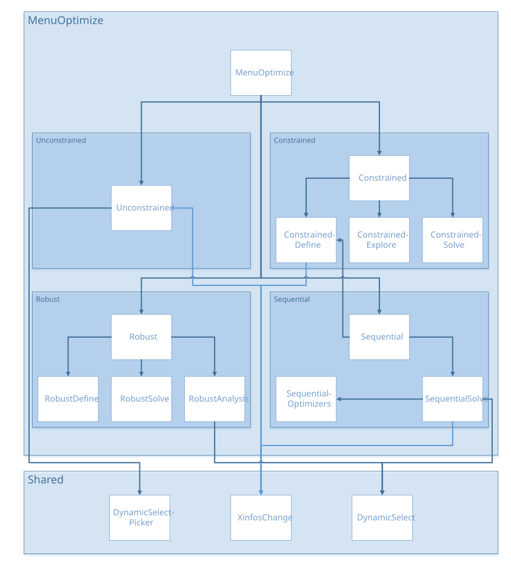

Menu Optimize
#############

Tutorials
*********

.. |pdf_1| image:: ../_images/icons/pdf64.png
   :target: https://gitlab.com/drti/lagun/-/raw/master/documentation/tutorials/Lagun_Tutorial7_Optimization.pdf

.. |pdf_2| image:: ../_images/icons/pdf64.png
   :target: https://gitlab.com/drti/lagun/-/raw/master/documentation/tutorials/Lagun_Tutorial8_Optimization%20under%20uncertainty.pdf

.. |pdf_3| image:: ../_images/icons/pdf64.png
   :target: https://gitlab.com/drti/lagun/-/raw/master/documentation/tutorials/Lagun_Tutorial9_Sequential%20optimization.pdf

.. list-table::
   :widths: 80 20

   * - Optimization
     - |pdf_1|
   * - Optimization under Uncertainty
     - |pdf_2|
   * - Sequential Optimization
     - |pdf_3|

Architecture
************

menuOptimize.R
**************

``source("modules/menuOptimize/unconstrained/unconstrained.R", local = TRUE)``
``source("modules/menuOptimize/constrained/constrained.R", local = TRUE)``
``source("modules/menuOptimize/sequential/sequential.R", local = TRUE)``
``source("modules/menuOptimize/robust/robust.R", local = TRUE)``

UI and Server functions
=======================

.. py:function:: menuOptimize.ui(id)

   This function adds the menu "Optimize" to the user interface, and creates the pages:

   * Page *Optimization with Surrogate Model*
      * Panel *Unconstrained Optimization*
      * Panel *Constrained Optimization*
   * Page *Sequential Optimization with Surrogate Model*
   * Page *Robust Optimization with Surrogate Model*

   :param character id: namespace of the module

   .. rubric:: Main reactives:

   * Calls ``unconstrained.ui()`` with id **unconstrained**
   * Calls ``constrained.ui()`` with id **constrained**
   * Calls ``sequential.ui()`` with id **sequential**
   * Calls ``robust.ui()`` with id **robust**

.. py:function:: menuOptimize.server(input, output, session, DOE, listmodels, advance.importDOE, settings, use_simulator)

   :param list-like-object input: stores the widgets' values.
   :param list-like-object output: stores the instructions to build R objects in the app.
   :param object session: environment that can be used to access information and functionality relating to the session.
   :param object DOE: stores the point values and the DOE information (e.g. bounds...)
   :param list listmodels: list of trained models
   :param object advance.importDOE: stores the simulation information status (completed/waiting/running) when Lagun is connected to an external simulator
   :param list-like-object settings: variables specified in settingsOptimization.R
   :param logical use_simulator: informs if the user uses a simulator linked to Lagun

   :return: extra points in the DOE to refine the model for a sequential optimization and to confirm constrained and unconstrained optimization results
   :rtype: list
   
   .. rubric:: Main reactives:

   * Calls ``unconstrained.server()`` with id **unconstrained**
   * Calls ``constrained.server()`` with id **constrained**
   * Calls ``sequential.server()`` with id **sequential**
   * Calls ``robust.server()`` with id **robust**

Unconstrained
*************

unconstrained.R
===============

``source("modules/shared/XinfosChange.R", local = TRUE)``
``source("modules/shared/dynamicSelect.R", local = TRUE)``

UI and Server functions
-----------------------

.. py:function:: unconstrained.ui(id)

   This function populates the *Unconstrained Optimization* panel

   :param character id: namespace of the module

   .. rubric:: Main reactives:

   * **chooseY1**: objective 1 selection
   * **chooseY2**: objective 2 selection
   * **sign1**: optimization type selection for objective 1
   * **sign2**: optimization type selection for objective 2
   * **goOptim**: button to launch optimization
   * **download**: button to export optimization results
   * **plotOptim**: displays optimization results plot
   * **tableOptim**: displays optimization results data as a table

.. py:function:: unconstrained.server(input, output, session, DOE, listmodels, settings, use_simulator)

   :param list-like-object input: stores the widgets' values.
   :param list-like-object output: stores the instructions to build R objects in the app.
   :param object session: environment that can be used to access information and functionality relating to the session.
   :param object DOE: stores the point values and the DOE information (e.g. bounds...)
   :param list listmodels: list of trained models
   :param list-like-object settings: variables specified in settingsOptimizations.R
   :param logical use_simulator: informs if the user uses a simulator linked to Lagun

   :return: extra points in the DOE to confirm unconstrained optimization results
   :rtype: list
   
   .. rubric:: Main reactives:

   * **resoptim**: stores optimization results and settings 
   * **choicesY1**: output variable list
   * **choicesY2**: output variable list
   * **output$tableOptim**: displays optimization results data as a table
   * **output$plotOptim**: displays optimization results plot
   * **output$download**: downloadable CSV file containing optimization results data

Main functions
--------------

.. py:function:: biObjectiveOptim(dimx, DOE, Xinfos, lb, ub, predfun, yname1, sign1, yname2, sign2)

   Performs bi-objective optimization using NSGA-II genetic algorithm [#nsga-ii]_

   :param numeric dimx: input variable dimension
   :param object DOE: stores the point values and the DOE information (e.g. bounds...)
   :param object Xinfos: input variable information
   :param numeric lb: lower bound
   :param numeric ub: upper bound
   :param function predfun: predict function of the selected metamodel
   :param character yname1: name of output variable for objective 1
   :param character sign1: optimization type for variable 1 (minimize or maximize)
   :param character yname2: name of output variable for objective 2
   :param character sign2: optimization type for variable 2 (minimize or maximize)

.. py:function:: monoObjectiveOptimWithoutCat(dimx, id, lb, ub, predfun, yname1, sign1, callback, inc, nmultistart)

   Performs mono-objective optimization using BFGS algorithm (without categorical variables)

   :param numeric dimx: input variable dimension
   :param integer id: output index of objective 1 (yname1)
   :param numeric lb: lower bound
   :param numeric ub: upper bound
   :param function predfun: predict function of the selected metamodel
   :param character yname1: name of output variable for objective 1
   :param character sign1: optimization type for variable 1 (minimize or maximize)
   :param function callback: reports progress
   :param numeric inc: iteration number for callback
   :param numeric nmultistart: number of initialization for multistart optimization

.. py:function:: monoObjectiveOptim(dimx, DOE, Xinfos, lb, ub, predfun, yname1, sign1, callback, nmultistart)

   Performs mono-objective optimization using BFGS algorithm 
   (brute force runs of monoObjectiveOptimWithoutCat for all combinations of categorical values)

   :param numeric dimx: input variable dimension
   :param object DOE: stores the point values and the DOE information (e.g. bounds...)
   :param object Xinfos: input variable information
   :param numeric lb: lower bound
   :param numeric ub: upper bound
   :param function predfun: predict function of the selected metamodel
   :param character yname1: name of output variable for objective 1
   :param character sign1: optimization type for variable 1 (minimize or maximize)
   :param function callback: reports progress
   :param numeric nmultistart: number of initialization for multistart optimization

Plot functions
--------------

.. py:function:: plotMonoObjectiveOptim(resoptim)

   Plots results for mono-objective optimization

   :param list resoptim: optimization results

.. thumbnail:: ../_images/graphs/menuOptimize_plotMonoObjective.png
   :align: center
   :title: plotMonoObjective()
   :class: framed

.. py:function:: plotBiObjectiveOptim(resoptim)

   Plots results for bi-objective optimization

   :param list resoptim: optimization results

Secondary functions
-------------------

.. py:function:: callback(inc, nm)__
   
   Reports progress of a task. Calls R Shiny *incProgress*

   :param numeric inc: inc\ :sup:`th` iteration
   :param numeric nm: nm\ :sup:`th` initialization

Constrained
***********

constrained.R
=============

``source("modules/menuOptimize/constrained/constrainedDefine.R", local = TRUE)``
``source("modules/menuOptimize/constrained/constrainedSolve.R", local = TRUE)``
``source("modules/menuOptimize/constrained/constrainedExplore.R", local = TRUE)``

UI and Server functions
-----------------------

.. py:function:: constrained.ui(id)

   Populates the *Constrained Optimization* panel with three subpanels:

   * Define Optimization Problem
   * Solve Optimization Problem
   * Explore Solution(s)
   
   :param character id: namespace of the module

   .. rubric:: Main reactives:

   * Calls ``constrainedDefine.ui()`` with id **constrainedDefine**
   * Calls ``constrainedSolve.ui()`` with id **constrainedSolve**
   * Calls ``constrainedExplore.ui()`` with id **constrainedExplore**

.. py:function:: constrained.server(input, output, session, DOE, listmodels, settings, use_simulator)

   :param list-like-object input: stores the widgets' values.
   :param list-like-object output: stores the instructions to build R objects in the app.
   :param object session: environment that can be used to access information and functionality relating to the session.
   :param object DOE: stores the point values and the DOE information (e.g. bounds...)
   :param list listmodels: list of trained models
   :param list-like-object settings: variables specified in settingsOptimizations.R
   :param logical use_simulator: informs if the user uses a simulator linked to Lagun

   :return: extra points in the DOE to confirm constrained optimization results
   :rtype: list
   
   .. rubric:: Main reactives:

   * Calls ``constrainedDefine.server()`` with id **constrainedDefine**
   * Calls ``constrainedSolve.server()`` with id **constrainedSolve**
   * Calls ``constrainedExplore.server()`` with id **constrainedExplore**

constrainedDefine.R
===================

``source("modules/shared/XinfosChange.R", local = TRUE)``

UI and Server functions
-----------------------

.. py:function:: constrainedDefine.ui(id)

   Populates the *Define Optimization Problem* subpanel

   :param character id: namespace of the module

   .. rubric:: Main reactives:

   * **optimdef**: button to define the problem formulation, opens modal window containing:

      * **file**: file input to upload the problem formulation
      * **obj1.ui, obj2.ui**: objective selection (output variables)
      * **signobj1.ui, signobj2.ui**: optimization type selection
      * **nbcons.ui**: input for the number of constraints
      * **listconstraints.ui**: list of defined contraints
      * **saveoptimdef**: button to save and close
      * **closeoptimdef**: button to cancel problem formulation

   * **downloadformulation**: button to export problem formulation
   * **XinfosChange.ui(ns("bounds"))**: button to change input information
   * **XinfosChange.ui.preview(ns("bounds"))**: displays table to preview input information
   * **thresholds**: displays thresholds as a table
   * **optimTypes**: displays optimization types as a table

.. py:function:: constrainedDefine.server(input, output, session, DOE, listmodels, nbcons.min = 1, nbobj = 1, simulations = NULL)

   :param list-like-object input: stores the widgets' values.
   :param list-like-object output: stores the instructions to build R objects in the app.
   :param object session: environment that can be used to access information and functionality relating to the session.
   :param object DOE: stores the point values and the DOE information (e.g. bounds...)
   :param list listmodels: list of trained models
   :param numeric nbcons.min: minimum number of contraints (default=1)
   :param numeric nbobj: number of objectives (default=1)
   :param object simulations: simulations if a simulator is connected to Lagun (default=NULL)

   .. rubric:: Main reactives:

   * **COformulation**: contains constraint formulation
   * **choicesY, choicesY2**: contains output variables
   * **output$obj1.ui, output$obj2.ui**: selected optimization objectives
   * **output$signobj1.ui, output$signobj2.ui**: selected optimization types
   * **output$nbcons.ui**: number of constraints input
   * **output$listconstraints.ui**: UI containing the defined constraints
   * **output$thresholds**: table containing thresholds
   * **output$optimTypes**: table containing optimization types
   * **output$downloadformulation**: downloadable TXT file containing constraint formulation

Main functions
--------------

.. py:function:: getCOformulationThresholds(COformulation, ynames)

   Returns a matrix with the threshold for each output

   :param list COformulation: constraint formulation
   :param list ynames: output variable names

.. py:function:: getCOformulationOptimTypes(COformulation, ynames)

   Returns a matrix with optimization type for each output

   :param list COformulation: constraint formulation
   :param list ynames: output variable names

.. py:function:: getCOformulation(dinit, ynames)

   Returns constraint formulation with thresholds and optimization types.
   Calls ``getCOformulationThresholds`` and ``getCOformulationOptimTypes``

   :param list dinit: intial constraint formulation
   :param list ynames: output variable names

.. py:function:: check.CO.formulation(dinit, ynames, nbobj)

   Checks if contraint formulation is valid

   :param list dinit: intial constraint formulation
   :param list ynames: output variable names
   :param numeric nbobj: number of objectives 

constrainedSolve.R
==================

UI and Server functions
-----------------------

.. py:function:: constrainedSolve.ui(id)

   Populates the *Solve Optimization Problem* panel

   :param character id: namespace of the module

   .. rubric:: Main reactives:

   * **go**: button to launch optimization
   * **OptimFailed**: display choice if no optimum satisfying all constraints is found
   * **download**: button to export optimization results
   
   * *Graphical Representation*:
      * **plotObj**: displays objective plot
      * **plotConstr**: displays constraint plot

   * *Table Representation*:
      * **table**: displays optimization results as a table

.. py:function:: constrainedSolve.server(input, output, session, DOE, listmodels, Xinfos, COformulation, settings, use_simulator)

   :param list-like-object input: stores the widgets' values.
   :param list-like-object output: stores the instructions to build R objects in the app.
   :param object session: environment that can be used to access information and functionality relating to the session.
   :param object DOE: stores the point values and the DOE information (e.g. bounds...)
   :param list listmodels: list of trained models
   :param object Xinfos: input variable information
   :param list COformulation: constraint formulation
   :param list-like-object settings: variables specified in settingsOptimizations.R
   :param logical use_simulator: informs if the user uses a simulator linked to Lagun

   :return: resCoptim & simulations
   :rtype: list
   
   .. rubric:: Main reactives:

   * **resCoptim**: contains constrained optimization results
   * **simulations**: contains extra points in the DOE to confirm constrained optimization results
   * **output$plotObj**: displays objective plot
   * **output$plotConstr**: displays constraint plot
   * **output$table**: displays optimization results as a table
   * **output$download**: downloadable CSV file containing constrained optimization results

Main functions
--------------

.. py:function:: computeConstrainedOptimWithoutCat(dimx, lb, ub, predfun, COformulation, COalgo, inc, nmultistart, callback)

   Performs constrained optimization without categorical variables, using one of the following methods:

   * COBYLA [#cobyla]_
   * ISRES [#isres]_
   * AUGLAG [#auglag]_ + COBYLA [#cobyla]_
   * SQP [#sqp]_

   :param numeric dimx: input variable dimension
   :param numeric lb: lower bound
   :param numeric ub: upper bound
   :param function predfun: predict function of the selected metamodel
   :param list COformulation: constraint formulation
   :param character COalgo: constrained optimization algorithm
   :param numeric inc: iteration number
   :param numeric nmultistart: number of initialization for multistart optimization
   :param function callback: reports progress
   
.. py:function:: computeConstrainedBiOptimWithoutCat(dimx, lb, ub, predfun, COformulation)

   Performs constrained bi-objective optimization without categorical variables using NSGA-II genetic algorithm [#nsga-ii]_

   :param numeric dimx: input variable dimension
   :param numeric lb: lower bound
   :param numeric ub: upper bound
   :param function predfun: predict function of the selected metamodel
   :param list COformulation: constraint formulation

.. py:function:: computeConstrainedOptim(dimx, DOE, Xinfos, lb, ub, predfun, COformulation, COalgo, nmultistart, callback)

   Performs constrained optimization calling computeConstrainedOptimWithoutCat 
   (iteratively if some inputs are categorical to explore all combinations)

   :param numeric dimx: input variable dimension
   :param object DOE: stores the point values and the DOE information (e.g. bounds...)
   :param object Xinfos: input variable information
   :param numeric lb: lower bound
   :param numeric ub: upper bound
   :param function predfun: predict function of the selected metamodel
   :param list COformulation: constraint formulation
   :param character COalgo: constrained optimization algorithm
   :param numeric nmultistart: number of initialization for multistart optimization
   :param function callback: reports progress

.. py:function:: computeConstrainedBiOptim(dimx, DOE, Xinfos, lb, ub, predfun, COformulation, callback)

   Performs constrained bi-objective optimization calling computeConstrainedBiOptimWithoutCat 
   (iteratively if some inputs are categorical to explore all combinations)

   :param numeric dimx: input variable dimension
   :param object DOE: stores the point values and the DOE information (e.g. bounds...)
   :param object Xinfos: input variable information
   :param numeric lb: lower bound
   :param numeric ub: upper bound
   :param function predfun: predict function of the selected metamodel
   :param list COformulation: constraint formulation
   :param function callback: reports progress

Plot functions
--------------

.. py:function:: plotConstrainedOptimBiObj(DOE, COformulation, resCoptim)

   Plots bi-objective optimization results

   :param object DOE: stores the point values and the DOE information (e.g. bounds...)
   :param list COformulation: constraint formulation
   :param list resCoptim: constrained optimization results

.. py:function:: plotConstrainedOptimObj(DOE, COformulation, resCoptim)

   Plots optimization results

   :param object DOE: stores the point values and the DOE information (e.g. bounds...)
   :param list COformulation: constraint formulation
   :param list resCoptim: constrained optimization results

.. py:function:: plotConstrainedOptimConstr(DOE, COformulation, resCoptim)

   Plots optimization constraint satisfaction

   :param object DOE: stores the point values and the DOE information (e.g. bounds...)
   :param list COformulation: constraint formulation
   :param list resCoptim: constrained optimization results

Secondary functions
-------------------

.. py:function:: get.resCoptim.table(DOE, COformulation, resCoptim, choiceOptimFailed)

   Shapes optimization results as a data.frame

   :param object DOE: stores the point values and the DOE information (e.g. bounds...)
   :param list COformulation: constraint formulation
   :param list resCoptim: constrained optimization results
   :param character choiceOptimFailed: choice to display if no optimum satisfying all constraints was found

.. py:function:: get.resCoptim.export(DOE, COformulation, resCoptim, choiceOptimFailed)

   Shapes optimization results as a data.frame for file export

   :param object DOE: stores the point values and the DOE information (e.g. bounds...)
   :param list COformulation: constraint formulation
   :param list resCoptim: constrained optimization results
   :param character choiceOptimFailed: choice to display if no optimum satisfying all constraints was found

.. py:function:: callback(inc, i)__

   Reports progress of a task. Calls R Shiny *incProgress*

   :param numeric inc: inc\ :sup:`th` iteration
   :param numeric i: i\ :sup:`th` initialization (multistart)

constrainedExplore.R
====================

UI and Server functions
-----------------------

.. py:function:: constrainedExplore.ui(id)

   Populates the *Explore Solution(s)* panel

   :param character id: namespace of the module

   .. rubric:: Main reactives:

   * **parcoords**: parallel plot

.. py:function:: constrainedExplore.server(input, output, session, DOE, listmodels, COformulation, resCoptim, settings)

   :param list-like-object input: stores the widgets' values.
   :param list-like-object output: stores the instructions to build R objects in the app.
   :param object session: environment that can be used to access information and functionality relating to the session.
   :param object DOE: stores the point values and the DOE information (e.g. bounds...)
   :param list listmodels: list of trained models
   :param list COformulation: constraint formulation
   :param list resCoptim: constrained optimization results
   :param list-like-object settings: variables specified in settingsOptimizations.R

   .. rubric:: Main reactives:

   * **Yinfos**: contains the output variable information
   * **output$parcoords**: displays the parallel plot

Main functions
--------------

Plot functions
--------------

Secondary functions
-------------------

.. py:function:: getParcoordsCOExplo(DOE, predfun, lb, ub, COformulation, resCoptim, Yinfos, nobsparcoords)

   Builds a parallel plot of the constrained optimization

   :param object DOE: stores the point values and the DOE information (e.g. bounds...)
   :param function predfun: predict function of the selected metamodel
   :param numeric lb: lower bound
   :param numeric ub: upper bound
   :param list COformulation: constraint formulation
   :param list resCoptim: constrained optimization results
   :param object Yinfos: output variable information
   :param numeric nobsparcoords: number of observations

Sequential
**********

sequential.R
============

``source("modules/menuOptimize/constrained/constrainedDefine.R", local = TRUE)``
``source("modules/menuOptimize/sequential/sequentialSolve.R", local = TRUE)``

UI and Server functions
-----------------------

.. py:function:: sequential.ui(id)

   Builds the *Sequential Optimization with Surrogate Model* page with two panels:

   * *Define Optimization Problem*
   * *Solve Optimization Problem*

   :param character id: namespace of the module

   .. rubric:: Details

   * calls ``constrainedDefine.ui()`` with id **sequentialDefine**
   * calls ``sequentialSolve.ui()`` with id **sequentialSolve**

.. py:function:: sequential.server(input, output, session, DOE, listmodels, advance.importDOE, settings)

   :param list-like-object input: stores the widgets' values.
   :param list-like-object output: stores the instructions to build R objects in the app.
   :param object session: environment that can be used to access information and functionality relating to the session.
   :param object DOE: stores the point values and the DOE information (e.g. bounds...)
   :param list listmodels: list of trained models
   :param object advance.importDOE: stores the simulation information status (completed/waiting/running) when Lagun is connected to an external simulator
   :param list-like-object settings: variables specified in settingsOptimizations.R

   .. rubric:: Details

   * calls ``constrainedDefine.server()`` with id **sequentialDefine**
   * calls ``sequentialSolve.server()`` with id **sequentialSolve**

sequentialOptimizers.R
======================

Main functions
--------------

.. py:function:: available.seq.optimizers()

   Returns available sequential optimizers

.. py:function:: acquisition.function(dimx, objs, minimize, idconstr, boundsO, boundsC, sdreweightedloo=FALSE)

   Builds function to compute a criterion according to the constraints and the optimization type

   :param numeric dimx: input variable dimension
   :param object objs: trained metamodels and their information
   :param logical minimize: informs whether the optimization type is a minimization
   :param character idconstr: variables on which a constraint is applied, if any
   :param list boundsO: objective bounds
   :param list boundsC: constraint bounds
   :param logical sdreweightedloo: indicates whether the standard deviation should be weighted by the error (default=FALSE)

.. py:function:: acquisition.function.MO(dimx, objs, minimize, idconstr, boundsO, boundsC, sdreweightedloo=FALSE)

   Same as ``acquisition.function()`` but for MO algorithm

   :param numeric dimx: input variable dimension
   :param object objs: trained metamodels and their information
   :param logical minimize: informs whether the optimization type is "minimize"
   :param character idconstr: variables on which a constraint is applied, if any
   :param list boundsO: objective bounds
   :param list boundsC: constraint bounds
   :param logical sdreweightedloo: indicates whether the standard deviation should be weighted by the error (default=FALSE)

.. py:function:: EGO.seq.optimize(models, Xinfos, DOE, npts = 1, idobj = 1, minimize=TRUE, idconstr=NULL, boundsO, boundsC, settings)

   Performs EGO sequential optimization

   :param list models: list of trained metamodels
   :param object Xinfos: input variable information
   :param object DOE: stores the point values and the DOE information (e.g. bounds...)
   :param numeric npts: number of points / observations (default=1)
   :param numeric idobj: model ID (default=1)
   :param logical minimize: informs whether the optimization type is "minimize" (default=TRUE)
   :param character idconstr: variables on which a constraint is applied, if any (default=NULL)
   :param list boundsO: objective bounds
   :param list boundsC: constraint bounds
   :param list-like-object settings: variables specified in settingsOptimizations.R

.. py:function:: EGO.seq.settings()

   Retruns EGO optimizer settings

.. py:function:: RS.seq.optimize(models, Xinfos, DOE, npts = 1, idobj = 1, minimize=TRUE, idconstr=NULL, boundsO=NULL, boundsC=NULL, settings = NULL)

   Performs RS sequential optimization

   :param list models: list of trained metamodels
   :param object Xinfos: input variable information
   :param object DOE: stores the point values and the DOE information (e.g. bounds...)
   :param numeric npts: number of points / observations (default=1)
   :param numeric idobj: model ID (default=1)
   :param logical minimize: informs whether the optimization type is "minimize" (default=TRUE)
   :param character idconstr: variables on which a constraint is applied, if any (default=NULL)
   :param list boundsO: objective bounds (default=NULL)
   :param list boundsC: constraint bounds (default=NULL)
   :param list-like-object settings: variables specified in settingsOptimizations.R (default=NULL)

.. py:function:: RS.seq.settings()

   Retruns RS optimizer settings

sequentialSolve.R
=================

``source("modules/shared/XinfosChange.R", local = TRUE)``
``source("modules/shared/dynamicSelect.R", local = TRUE)``
``source("modules/menuOptimize/sequential/sequentialOptimizers.R", local = TRUE)``

UI and Server functions
-----------------------

.. py:function:: sequentialSolve.ui(id)

   Populates the panel *Solve Optimization Problem*

   :param character id: namespace of the module

   .. rubric:: Details

   * **chooseOptimAlgo**: optimization algorithm selection
   * **nitermax**: input to define the number max of iteration
   * **nptsiter**: input to define the number of points per iteration
   * **optimsettings**: button to display advanced settings
      
      * **settings.dynui**: displays advanced settings
   

   * **launchButtonUI**: button to launch optimization
   * **stopOptim**: button to stop optimization
   * **restartOptim**: button to restart optimization
   * **settings.dynui**: button to display advanced optimizer settings
      

   * **studyIter**: button to display iteration analysis
      
      * **sliderIter.dynui**: slider to choose iteration to analyze
      * **plotRadar**: Constraint Visualization: DOE quantiles, thresholds and current iteration
      * **Xaddcontents**: displays input variables selected iterations as a table

   * **rowvisu.dynui**: displays optimization results plot, constraints heatplot, Q2 plot

.. py:function:: sequentialSolve.server(input, output, session, DOE, listmodels, Xinfos, COformulation, advance.importDOE, settings)

   :param list-like-object input: stores the widgets' values.
   :param list-like-object output: stores the instructions to build R objects in the app.
   :param object session: environment that can be used to access information and functionality relating to the session.
   :param object DOE: stores the point values and the DOE information (e.g. bounds...)
   :param list listmodels: list of trained models
   :param object Xinfos: input variable information
   :param list COformulation: constraint formulation
   :param object advance.importDOE: stores the simulation information status (completed/waiting/running) when Lagun is connected to an external simulator
   :param list-like-object settings: variables specified in settingsOptimizations.R

   .. rubric:: Details

   
   * **choicesOptimAlgo**: optimization algorithm selection
   * **output$launchButtonUI**: button to launch optimization
   

   * **output$sliderIter.dynui**: slider input fir iteration number selection
   * **output$plotRadar**: displays radar plot
   * **output$Xaddcontents**: builds table with input variables selected iterations

   * **output$rowvisu.dynui**: displays optimization results plot, constraints heatplot, Q2 plot

      * **output$plotObj**: builds optimization results plot
      * **output$plotConstr**: builds constraints heatplot
      * **output$plotQ2**: builds Q2 plot
   

Plot functions
--------------

.. py:function:: update.plots.pred(DOE, COformulation, seq, simulations, nitermax, session, npts)

   Updates plots with outputs that are compliant with the contraints when a simulator is used

   :param object DOE: stores the point values and the DOE information (e.g. bounds...)
   :param list COformulation: constraint formulation
   :param object seq: contains sequential optimization data and results
   :param object simulations: simulations if a simulator is connected to Lagun
   :param numeric nitermax: number max of iterations
   :param object session: environment that can be used to access information and functionality related to the session
   :param numeric npts: number of points per iteration

.. py:function:: update.plots(DOE, COformulation, seq, simulations, nitermax, session, npts)

   Updates plots with outputs that are compliant with the contraints

   :param object DOE: stores the point values and the DOE information (e.g. bounds...)
   :param list COformulation: constraint formulation
   :param object seq: contains sequential optimization data and results
   :param object simulations: simulations if a simulator is connected to Lagun
   :param numeric nitermax: number max of iterations
   :param object session: environment that can be used to access information and functionality related to the session
   :param numeric npts: number of points per iteration

Secondary functions
-------------------

.. py:function:: respect.constraints(Y, signconstr, thconstr)

   Checks if the outputs are compliant with the contraints

   :param list Y: output variable list
   :param numeric signconstr: optimization type / sign (-1 or 1)
   :param numeric thconstr: constraint threshold

.. py:function:: getlbub(signs, thresholds)

   Returns lower-bounds and upper-bounds of the threshold vector

   :param numeric signs: optimization type / sign (-1 or 1)
   :param numeric thconstr: constraint threshold

Robust
******

robust.R
========

``source("modules/menuOptimize/robust/robustDefine.R", local = TRUE)``
``source("modules/menuOptimize/robust/robustAnalysis.R", local = TRUE)``
``source("modules/menuOptimize/robust/robustSolve.R", local = TRUE)``

UI and Server functions
-----------------------

.. py:function:: robust.ui(id)

   Builds the *Robust Optimization with Surrogate Model* page with two panels:

   * *Define Optimization Problem*
   * *Preliminary Analysis*
   * *Solve Problem*

   :param character id: namespace of the module

   .. rubric:: Details

   * calls ``robustDefine.ui()`` with id **robustDefine**
   * calls ``robustAnalysis.ui()`` with id **robustAnalysis**
   * calls ``robustSolve.ui()`` with id **robustSolve**

.. py:function:: robust.server(input, output, session, DOE, listmodels, settings)

   :param list-like-object input: stores the widgets' values.
   :param list-like-object output: stores the instructions to build R objects in the app.
   :param object session: environment that can be used to access information and functionality relating to the session.
   :param object DOE: stores the point values and the DOE information (e.g. bounds...)
   :param list listmodels: list of trained models
   :param list-like-object settings: variables specified in settingsOptimizations.R

   .. rubric:: Details

   * calls ``robustDefine.server()`` with id **robustDefine**
   * calls ``robustAnalysis.server()`` with id **robustAnalysis**
   * calls ``robustSolve.server()`` with id **robustSolve**

Secondary functions
-------------------

.. py:function:: q10(v)

   Returns 10% quantile

   :param vector v: data vector of numerical values

.. py:function:: q90(v)

   Returns 90% quantile

   :param vector v: data vector of numerical values

robustDefine.R
==============

UI and Server functions
-----------------------

.. py:function:: robustDefine.ui(id)

   Populates the panel *Define Optimization Problem*

   :param character id: namespace of the module

   .. rubric:: Details

   * **design**: table containing formulation design
   * **thresholds**: table containing formulation thresholds
   * **optimTypes**: table containing formulation optimization types

.. py:function:: robustDefine.server(input, output, session, DOE)

   :param list-like-object input: stores the widgets' values.
   :param list-like-object output: stores the instructions to build R objects in the app.
   :param object session: environment that can be used to access information and functionality relating to the session.
   :param object DOE: stores the point values and the DOE information (e.g. bounds...)

   .. rubric:: Details

   * **ROformulation**: contains formulation information
   * **output$error.file**: errors returned by ``check.RO.formulation()`` if any
   * **output$design**: builds table containing formulation design
   * **output$thresholds**: builds table containing formulation thresholds
   * **output$optimTypes**: builds table containing formulation optimization types

Main functions
--------------

.. py:function:: getROformulationDesign(DOE, ROformulation)

   Returns formulation design (variable type, mean, standard deviation) as a data.frame

   :param object DOE: stores the point values and the DOE information (e.g. bounds...)
   :param list ROformulation: Robust Optimization formulation

.. py:function:: getROformulationThresholds(DOE, ROformulation)

   Returns formulation thresholds

   :param object DOE: stores the point values and the DOE information (e.g. bounds...)
   :param list ROformulation: Robust Optimization formulation

.. py:function:: getROformulationOptimTypes(DOE, ROformulation)

   Returns formulation optimization types

   :param object DOE: stores the point values and the DOE information (e.g. bounds...)
   :param list ROformulation: Robust Optimization formulation

.. py:function:: getROformulation(dinit, DOE)

   Returns the complete formulation using the functions above.

   :param object dinit: content of the input file
   :param object DOE: stores the point values and the DOE information (e.g. bounds...)

Secondary functions
-------------------

.. py:function:: check.RO.formulation(dinit, nX, nY)

   Checks if content of the input file is valid

   :param object dinit: content of the input file
   :param numeric nX: number of inputs
   :param numeric nY: number of outputs

robustAnalysis.R
================

``source("modules/shared/dynamicSelect.R", local = TRUE)``

UI and Server functions
-----------------------

.. py:function:: robustAnalysis.ui(id)

   Populates the panel *Preliminary Analysis*

   :param character id: namespace of the module

   .. rubric:: Details

   * **chooseY**: output variable selection
   * **contentC**: displays estimation of problem complexity
   * **plotpairPrelimIndiv**: pairplot to check the probability of respecting the selected constraint
   * **plotpairPrelimJoint**: pairplot to check the probability of respecting all constraints simultaneously
   * **plotPrelimC**: plots constraint satisfaction probability

.. py:function:: robustAnalysis.server(input, output, session, DOE, listmodels, ROformulation)

   :param list-like-object input: stores the widgets' values.
   :param list-like-object output: stores the instructions to build R objects in the app.
   :param object session: environment that can be used to access information and functionality relating to the session.
   :param object DOE: stores the point values and the DOE information (e.g. bounds...)
   :param list listmodels: list of trained models
   :param list ROformulation: Robust Optimization formulation

   .. rubric:: Main reactives:

   * **choicesY**: output variable selection
   * **resPrelimC**: preliminary constraint evaluation
   * **output$contentC**: estimation of problem complexity as a table
   * **output$plotPrelimC**: plots constraint satisfaction probability
   * **output$plotpairPrelimIndiv**: plots probability of respecting the selected constraint
   * **output$plotpairPrelimJoint**: plots probability of respecting all constraint

Main functions
--------------

.. py:function:: getResPrelimC.proba(DOE, ROformulation, resPrelimC)

   Computes percentage of tested points whose probability to respect the constraint 
   is greater than a control level of 0.9, 0.95 and 0.99.

   :param object DOE: stores the point values and the DOE information (e.g. bounds...)
   :param list ROformulation: Robust Optimization formulation
   :param list resPrelimC: preliminary constraint evaluation

.. py:function:: evaluateConstraints(DOE, lb, ub, predfun, ROformulation, nlhs, callback)

   Generates a Monte Carlo random sample and evaluates which points satisfy the defined constraints

   :param object DOE: stores the point values and the DOE information (e.g. bounds...)
   :param numeric lb: lower bound
   :param numeric ub: upper bound
   :param function predfun: predict function of the selected metamodel
   :param list ROformulation: Robust Optimization formulation
   :param numeric nlhs: number of points
   :param function callback: reports progress

Plot functions
--------------

.. py:function:: plotPrelimC(DOE, ROformulation, resPrelimC, yname)

   Plots constraint satisfaction probability

   :param object DOE: stores the point values and the DOE information (e.g. bounds...)
   :param list ROformulation: Robust Optimization formulation
   :param list resPrelimC: preliminary constraint evaluation
   :param character yname: output variable name

.. py:function:: plotpairPrelimIndiv(DOE, ROformulation, resPrelimC, yname)

   Plots a pairplot to check the probability of respecting the selected constraint

   :param object DOE: stores the point values and the DOE information (e.g. bounds...)
   :param list ROformulation: Robust Optimization formulation
   :param list resPrelimC: preliminary constraint evaluation
   :param character yname: output variable name

.. py:function:: plotpairPrelimJoint(DOE, ROformulation, resPrelimC, yname)

   Plots a pairplot to check the probability of respecting all constraints simultaneously

   :param object DOE: stores the point values and the DOE information (e.g. bounds...)
   :param list ROformulation: Robust Optimization formulation
   :param list resPrelimC: preliminary constraint evaluation
   :param character yname: output variable name

Secondary functions
-------------------

.. py:function:: callback(i)__

   Reports progress of a task. Calls R Shiny *incProgress*

   :param numeric i: i\ :sup:`th` iteration

robustSolve.R
=============

UI and Server functions
-----------------------

.. py:function:: robustSolve.ui(id)

   Populates the panel *Solve Problem*

   :param character id: namespace of the module

   .. rubric:: Details

   * **go**: button to launch robust optimization
   * **ROcrit**: robust optimization criterion selection
   * **threshproba**: constraint probability selection
   * **download**: button to export optimization results

.. py:function:: robustSolve.server(input, output, session, DOE, listmodels, ROformulation, settings)

   :param list-like-object input: stores the widgets' values.
   :param list-like-object output: stores the instructions to build R objects in the app.
   :param object session: environment that can be used to access information and functionality relating to the session.
   :param object DOE: stores the point values and the DOE information (e.g. bounds...)  
   :param list listmodels: list of trained models
   :param list ROformulation: Robust Optimization formulation
   :param list-like-object settings: variables specified in settingsOptimizations.R

   .. rubric:: Details

   * **resRoptim**: contains optimization information and results
   * **output$plot**: displays plot of optimization results 
   * **output$table**: displays table of optimization results 
   * **output$download**: downloadble CSV file containing optimization results

Main functions
--------------

.. py:function:: get.resRoptim.table(DOE, ROformulation, resRoptim, ROcrit)

   Shapes optimization results as a data.frame

   :param object DOE: stores the point values and the DOE information (e.g. bounds...)
   :param list ROformulation: Robust Optimization formulation
   :param object resRoptim: optimization results
   :param character ROcrit: robust optimization criterion

.. py:function:: get.resRoptim.export(DOE, ROformulation, resRoptim)

   Shapes optimization results as a data.frame for file export

   :param object DOE: stores the point values and the DOE information (e.g. bounds...)
   :param list ROformulation: Robust Optimization formulation
   :param object resRoptim: optimization results

.. py:function:: computeRobustOptim(DOE, lb, ub, predfun, ROformulation, threshold, ROalgo, ROcrit, nmultistart, callback)

   Performs robust optimization using one of the following methods:

   * COBYLA [#cobyla]_
   * ISRES [#isres]_
   * AUGLAG [#auglag]_ + COBYLA [#cobyla]_
   * SQP [#sqp]_

   :param object DOE: stores the point values and the DOE information (e.g. bounds...)
   :param numeric lb: lower bound
   :param numeric ub: upper bound
   :param function predfun: predict function of the selected metamodel
   :param list ROformulation: Robust Optimization formulation
   :param numeric threshold: threshold, constraint probability
   :param character ROalgo: optimization algorithm
   :param character ROcrit: optimization criterion (mean, quantile 10%, quantile 90%)
   :param numeric nmultistart: number of initialization for multistart optimization
   :param function callback: reports progress

Plot functions
--------------

.. py:function:: plotRobustOptim(DOE, ROformulation, resRoptim)

   Plots robust optimization results

   :param object DOE: stores the point values and the DOE information (e.g. bounds...)
   :param list ROformulation: Robust Optimization formulation
   :param object resRoptim: optimization results

Secondary functions
-------------------

.. py:function:: callback(i)__

   Reports progress of a task. Calls R Shiny *incProgress*

   :param numeric i: i\ :sup:`th` iteration

References
**********

.. [#nsga-ii]

   **NSGA-II Genetic Algorithm**

   Deb, K., Pratap, A., Agarwal, S. and Meyarivan, T. (2012) *A fast and elitist multiobjective genetic algorithm: NSGA-II*, in IEEE Transactions on Evolutionary Computation, vol. 6, no. 2, pp. 182-197

.. [#cobyla]

   **Constrained Optimization by Linear Approximations**

   Powell, M. J. D. (1994) *A direct search optimization method that models the objective and constraint functions by linear interpolation*, in Advances in Optimization and Numerical Analysis, eds. S. Gomez and J.-P. Hennart

   `R function documentation <https://www.rdocumentation.org/packages/nloptr/versions/1.2.2.2/topics/cobyla>`__
   | R Package: `nloptr <https://cran.r-project.org/package=nloptr>`__

.. [#isres]

   **Improved Stochastic Ranking Evolution Strategy**

   Thomas Philip Runarsson and Xin Yao (2005) *Search biases in constrained evolutionary optimization*, IEEE Trans. on Systems, Man, and Cybernetics Part C: Applications and Reviews, vol. 35 (no. 2), pp. 233-243 
   
   `R function documentation <https://www.rdocumentation.org/packages/nloptr/versions/1.2.2.2/topics/isres>`__
   | R Package: `nloptr <https://cran.r-project.org/package=nloptr>`__

.. [#auglag]

   **Augmented Lagrangian Algorithm**

   Andrew R. Conn, Nicholas I. M. Gould, and Philippe L. Toint (1991) *A globally convergent augmented Lagrangian algorithm for optimization with general constraints and simple bounds*, SIAM J. Numer. Anal. vol. 28, no. 2, p. 545-572 

   Birgin, E. G. and Martinez, J. M. (2008) *Improving ultimate convergence of an augmented Lagrangian method*, Optimization Methods and Software vol. 23, no. 2, p. 177-195 

   `R function documentation <https://www.rdocumentation.org/packages/nloptr/versions/1.2.2.2/topics/auglag>`__
   | R Package: `nloptr <https://cran.r-project.org/package=nloptr>`__
   
.. [#sqp]

   **Sequential Quadratic Programming**

   Nocedal, Jorge, and Stephen Wright (2006) *Numerical optimization*. Springer Science & Business Media

   `R function documentation <https://www.rdocumentation.org/packages/NlcOptim/versions/0.6/topics/solnl>`__
   | R Package: `NlcOptim <https://cran.r-project.org/package=NlcOptim>`__
